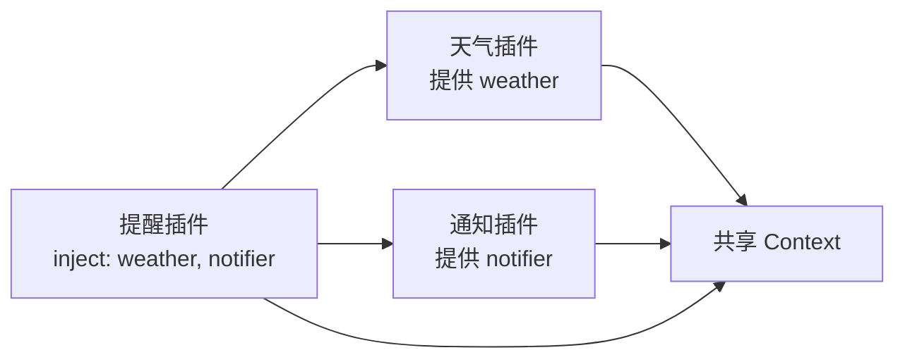

# 01：Cordis 核心心智模型

如果把 Cordis 当成“又一个依赖注入库”，你会很快碰到解释不通的地方：为什么插件能等待依赖？为什么一个事件监听器会自动消失？为什么服务提供方一卸载，使用它的插件也会跟着停？这些不是额外功能，而是 Cordis 的主线。

Cordis 管理的是一组有生命周期的插件。它让每个插件用同一种语言说明三件事：我提供什么能力、我开始前需要什么能力、我离开时留下的东西怎样撤销。这样，应用不必由一个中心调度器手工安排启动顺序和清理顺序。

## 先看全景：应用不是调用链，而是一张关系图

假设你做一个“天气提醒”小程序。它有三块能力：天气服务负责取得天气，提醒服务负责决定是否提醒，通知服务负责把消息发出去。用普通入口式思维，很容易写成这样：

```ts
const weather = new WeatherClient()
const notifier = new Notifier()
const reminder = new Reminder(weather, notifier)
await reminder.run()
```

这没有问题；小程序就该这样简单。但当应用允许替换天气来源、按配置启用通知渠道、热重载某个模块，或者一个能力要在不同子树中使用不同实现时，入口就会慢慢变成“谁先初始化谁、谁负责销毁谁”的总控中心。

Cordis 换了一个组织方式：



`reminder` 不需要导入或创建某个具体的 `WeatherClient`。它只说“运行前我需要名为 `weather` 和 `notifier` 的服务”。至于这两个服务由哪个插件提供，交给组合应用的配置决定。你可以在开发环境接一个假天气服务，在生产环境接真实 API；提醒插件不用改一行。

这里有一句值得慢慢体会的话：**Cordis 让依赖关系成为运行时可管理的数据，而不只是源码里的 import 关系。**

## 六个角色：把名字和责任分开记

| 名词 | 它是什么 | 你可以把它理解成 |
|---|---|---|
| Plugin（插件） | 一段被 Cordis 挂载、也能被卸载的功能单元。 | 一块带说明书的积木。 |
| Context（上下文，`ctx`） | 插件拿到的工作环境；服务、事件、插件注册等入口都在这里。 | 插件之间共用的工作台。 |
| Service（服务） | 以稳定名字挂在 `ctx` 上、可被其他插件调用的能力。 | 工作台上一台别人能使用的机器。 |
| `inject` | 插件声明的必需服务名称。 | 开工前必须到位的物料清单。 |
| Event（事件） | 一个已经发生或正在请求处理的信号，可有多个监听者。 | 不指名收件人的广播或协商通知。 |
| Fiber（纤程） | 某个插件的一次具体运行实例和其生命周期句柄。 | 这块积木本次被装上的“安装记录”。 |

它们不是六个互相竞争的概念。典型关系是：Cordis 为插件创建一个 Fiber；Fiber 拥有一个插件专属的子 `Context`；插件在其中提供服务、注册事件监听器和其他 effect；`inject` 决定 Fiber 何时可以进入运行状态。

```mermaid
flowchart TB
  root[根 Context] --> plugin[ctx.plugin(插件)]
  plugin --> fiber[Fiber：该插件本次实例]
  fiber --> child[子 Context]
  child --> service[提供 Service]
  child --> events[注册 Event 监听器]
  child --> effects[登记 effect：定时器、连接、disposer]
  fiber --> dispose[dispose 时统一撤销]
```

注意“本次实例”四个字。同一个插件模块可以被挂载多次，每一次都是不同 Fiber，各自有配置、状态和清理任务。不要把模块文件、插件定义和正在运行的插件实例混为一谈。

## 插件到底是什么

最常见的插件就是一个函数：

```ts
import type { Context } from '@deepseek-ai/cordis'

export function apply(ctx: Context) {
  console.log('插件开始工作')
}
```

当 Cordis 挂载它时，调用 `apply(ctx)`。这个函数不必返回一个业务对象；它的职责通常是往 `ctx` 上登记贡献，例如提供服务、监听事件、再挂载子插件，或建立一个需要清理的资源。

插件也可以是带 `apply` 方法的对象，或者继承 `Service` 的类。不要一开始就执着于选“最面向对象”的写法：只有当你确实要公开一个有状态、可调用的服务时，`Service` 类才会更顺手。单纯注册监听器或组装若干能力时，函数插件通常更直白。

```ts
// 函数插件：适合组装、监听、注册。
function auditPlugin(ctx: Context) {
  ctx.on('app/ready', () => console.log('应用已就绪'))
}

// 服务类：适合把一项可调用能力挂到 ctx 上。
class ClockService extends Service {
  constructor(ctx: Context) {
    super(ctx, 'exampleClock')
  }

  now() {
    return new Date()
  }
}
```

“插件是一项能力的所有者”是一个很好的判断标准。谁建立资源，谁就应通过自己的生命周期清理它；谁提供服务，谁就应负责它的可用性。这样卸载发生时，Cordis 不需要猜谁该收尾。

## Context 不是全局变量

`ctx` 看上去像一个方便的全局对象：可以写 `ctx.logger`、`ctx.tools`、`ctx.fs`。但它不是一份所有插件随意共享和修改的普通对象。每次插件启动，Cordis 都会在父 Context 的基础上建立一个子 Context；服务查找会沿着这棵上下文关系进行，注册内容则归当前 Fiber 所有。

因此，读 `ctx.weather` 的意思不是“从某个神秘单例读取属性”，而是“在当前作用范围内解析名为 `weather` 的服务”。这也解释了两个高级能力：

- `ctx.extend()` 创建携带额外元数据的子 Context，不修改父 Context。
- `ctx.isolate('shell')` 为某个服务名建立独立作用范围，让不同子树各自解析自己的 `shell` 服务。

在刚开始写 Harness 插件时，你通常不需要自己调用这两个 API；知道它们存在即可。更重要的习惯是：不要把服务实现藏进模块级变量，也不要跨插件保存来自别的服务的陈旧引用。请在插件需要时经由 `ctx` 使用服务，并用 `inject` 把硬性需求写出来。

## 服务和事件不是同一种通信

这是初学者最常见的岔路口。可以这样问自己：我是在“请某个能力做一件事”，还是在“通知任何感兴趣的人一件事发生了”？

| 需求 | 更适合的机制 | 原因 |
|---|---|---|
| 读取文件、发送模型请求、注册工具 | 服务 | 调用方期待明确能力、参数和返回结果。 |
| 记录日志、更新统计、刷新界面 | `emit` 事件 | 发出方不需要知道有谁在观察。 |
| 多个插件共同修饰一次模型请求 | `waterfall` 事件 | 监听器可以包裹下游处理或有意短路。 |
| 并发询问多个独立观察者 | `parallel` 事件 | 每个监听者都完成后再继续。 |
| 按顺序寻找第一个有效决定 | `serial` 事件 | 前一个监听者可给出结果并停止后续处理。 |

例如，“执行命令”是 `shell` 服务的方法：工具实现需要得到这一次执行的输出，所以它必须直接请求一个提供者；“命令执行结束”可以是事件：日志、界面、遥测都可能想观察它，但执行方不应逐个认识它们。

## Fiber：为什么 Cordis 能够安全地重载

Fiber 是 Cordis 替每次插件挂载保存的运行记录。它至少知道：这个插件依赖什么、拿到了什么配置、目前在哪个状态、登记了哪些清理动作。你平时通过 `ctx.plugin(plugin)` 得到 Fiber，也通过它的 `dispose()` 卸载插件。

```text
PENDING → LOADING → ACTIVE → UNLOADING → DISPOSED
                 ↘ FAILED
```

- `PENDING`：必需服务还没出现，Cordis 正在等。它不是失败，也不会占用事件循环。
- `LOADING`：正在执行插件的初始化。
- `ACTIVE`：插件已可工作。
- `FAILED`：初始化或配置校验报错。要看错误，不能把它当成“没加载”。
- `UNLOADING`：正在运行清理函数。
- `DISPOSED`：本次实例已经结束，不能重新复活；若要再运行，会创建一个新 Fiber。

这个状态机不是为了让你每天手动判断状态，而是让 Cordis 有可靠的卸载语义。当 `weather` 服务的提供方卸载时，依赖它的 `reminder` 插件不能继续带着旧服务工作；它会被一同卸载，等新提供方出现再重新加载。对可替换实现、配置更新和 HMR 来说，这比“服务对象忽然变成 undefined”安全得多。

## Effect：把“以后要收拾”的事在创建时说清楚

一个好的 Cordis 插件不仅会启动，还会离开得干净。服务注册和 `ctx.on()` 这类 Cordis API 会自动与当前 Fiber 绑定；但你自己创建的外部资源，例如 interval、socket、文件 watcher 或临时目录，Cordis 不会凭空知道如何处理。这时用 `ctx.effect()`：

```ts
import type { Context } from '@deepseek-ai/cordis'

export function apply(ctx: Context) {
  ctx.effect(() => {
    const timer = setInterval(() => console.log('still alive'), 1_000)
    return () => clearInterval(timer)
  })
}
```

effect 的主体在插件加载时运行；它返回的函数叫 disposer，在插件卸载时运行。把获取资源和登记清理放在同一个地方，读代码的人不用猜“这个 timer 究竟谁负责停”。如果释放步骤存在严格顺序，把它们写进同一个 disposer 里并依次 `await`；多个独立 effect 的异步 disposer 可能并行执行，不能把它们当成串行队列。

## 用一句话记住 Cordis

Cordis 不是替你写业务逻辑的框架；它负责让彼此独立的业务插件能够按依赖启动、在共享上下文协作，并在变化或退出时完整撤销。

带着这句话进入下一篇。我们不再停在概念图上，而是创建一个真正由 `cordis.yml` 组合出来的最小应用。
