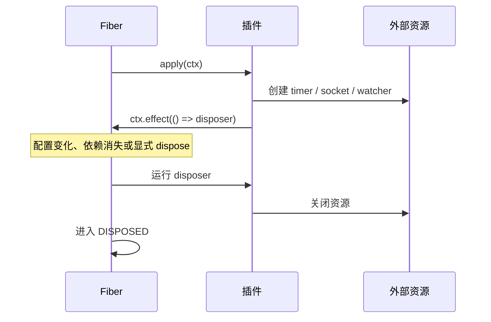

# 04：事件与生命周期

服务适合直接提出请求：我需要读文件，所以调用 `ctx.fs.readFile()`；我需要模型输出，所以调用 `ctx.llm`。但很多时候，发出方不该知道谁会关心一件事：工具执行结束后，也许日志、指标、界面和审计插件都想观察；模型请求发出前，也许策略、缓存和重试插件都想参与。

这时用事件。与此同时，事件监听器、定时器和连接都不是“注册后永远存在”的东西；它们必须随着插件离开而撤销。Cordis 把这两件事放在同一个生命周期模型中，因此这一篇要一起学。

## 先分清：事件是通知，不是服务的替身

事件的发出方只描述“发生了什么”或“请按此规则共同处理”，不指定具体接收者。服务则是调用方明确要求某项能力。

```mermaid
flowchart LR
  producer[工具运行时] -->|ctx.emit('tools/result')| bus[事件总线]
  bus --> log[日志插件]
  bus --> ui[UI 插件]
  bus --> metrics[指标插件]
  caller[Agent Loop] -->|ctx.llm.stream(...)| llm[LLM 服务]
```

一个实用判断法：如果调用者需要某一个确定的返回结果，优先设计服务方法；如果多个独立插件都可能观察或补充处理，而且发出方不应认识它们，使用事件。

## 声明、监听、发出

下面的例子提供一个带状态的计数服务。它每次计数变化后广播事件。

创建 `stats.ts`：

```ts
import { Service, type Context } from '@deepseek-ai/cordis'

declare module '@deepseek-ai/cordis' {
  interface Context {
    learningStats: StatsService
  }

  interface Events {
    'learning/stats/report'(name: string, count: number): void
  }
}

export class StatsService extends Service {
  private counts = new Map<string, number>()

  constructor(ctx: Context) {
    super(ctx, 'learningStats')
  }

  bump(name: string) {
    const next = (this.counts.get(name) ?? 0) + 1
    this.counts.set(name, next)
    this.ctx.emit('learning/stats/report', name, next)
  }
}

export function apply(ctx: Context) {
  ctx.plugin(StatsService)
}
```

创建监听者 `reporter.ts`：

```ts
import type { Context } from '@deepseek-ai/cordis'
import type {} from './stats.ts'

export const inject = ['learningStats']

export function apply(ctx: Context) {
  ctx.on('learning/stats/report', (name, count) => {
    console.log(`[统计] ${name} = ${count}`)
  })

  ctx.learningStats.bump('tool-call')
  ctx.learningStats.bump('tool-call')
}
```

配置：

```yaml
- name: './stats.ts'
- name: './reporter.ts'
```

输出应为：

```text
[统计] tool-call = 1
[统计] tool-call = 2
```

这里的 TypeScript 声明合并和服务章节很像。`interface Events` 给事件名和监听器参数签名一个共同定义，因此拼错事件名、漏传参数或监听器参数类型不对，都能尽早被 TypeScript 发现。建议使用 `领域/动作` 的名字，如 `tools/result`、`agent/status`、`learning/stats/report`；它比平铺的 `changed`、`done` 更容易搜索和维护。

## 五种分发方式：不是所有事件都该 `emit`

事件名与分发模式共同构成一个约定。不要只看“都是 `ctx.on()`”，还要看事件由哪个方法触发。

| 分发方式 | 调用形式 | 何时使用 | 监听器的关键规则 |
|---|---|---|---|
| `emit` | `ctx.emit(name, ...args)` | 同步通知；发出方不等待结果。 | 只观察，不把异步返回当作流程控制。 |
| `parallel` | `await ctx.parallel(name, ...args)` | 多个独立任务都要完成。 | 监听器可以并行，不能依赖彼此先后。 |
| `serial` | `await ctx.serial(name, ...args)` | 按顺序询问，首个有效答案决定结果。 | 返回非空、非 false 的结果会阻止后续监听器。 |
| `bail` | `ctx.bail(name, ...args)` | `serial` 的同步版本。 | 仅适合不需要等待的决策。 |
| `waterfall` | `ctx.waterfall(name, ...args, next)` | 需要包裹下游、改写结果或有意接管决定。 | 协作监听器必须调用 `next()`。 |

在 Harness 里，`tools/result` 是 `emit`：结果已经产生，监听者只需观察。`llm/stream` 和 `tools/pre-execute` 是 waterfall：策略或重试插件需要在真正调用前后包裹流程。分发模式不同，错误的监听器写法也不同；写插件前先去对应子系统的事件参考确认 `@mode`。

## Waterfall：最强大，也最容易误伤的事件

waterfall 可以把多个监听器组成一条环绕调用链。每个监听器拿到原始参数和 `next()`；调用 `next()` 才会继续执行下游。下面例子先让一个监听器把下游结果变成大写，第二个监听器在输入包含 `blocked` 时接管结果：

```ts
import type { Context } from '@deepseek-ai/cordis'

declare module '@deepseek-ai/cordis' {
  interface Events {
    'learning/transform'(input: string, next: () => Promise<string>): Promise<string>
  }
}

export function apply(ctx: Context) {
  ctx.on('learning/transform', async (input, next) => {
    const result = await next()
    return result.toUpperCase()
  })

  ctx.on('learning/transform', async (input, next) => {
    if (input.includes('blocked')) return '此请求已被策略接管'
    return next()
  })

  void (async () => {
    console.log(await ctx.waterfall('learning/transform', 'hello', async () => 'hello'))
    console.log(await ctx.waterfall('learning/transform', 'blocked request', async () => 'blocked request'))
  })()
}
```

结果是：

```text
HELLO
此请求已被策略接管
```

第二行的过程很值得在脑中走一遍：第一个监听器调用 `next()`；第二个监听器看到 `blocked` 后直接返回，最内层默认函数因此没有运行；返回到第一个监听器时，它仍可处理下游结果。一个监听器不调用 `next()` 不是“暂时什么都不做”，而是明确地把后续链路截断。

所以有一条必须养成的纪律：**只做记录、观测、轻微标注的 waterfall 监听器必须调用并返回 `next()`。** 只有这个插件真正拥有决定权、要替换或拒绝结果时，才有理由短路。漏写一次 `next()` 常常不会报错，却能让模型请求、审批或工具执行莫名消失。

## 生命周期：为什么 `ctx.on()` 不需要手动 remove

在 `apply()` 中调用：

```ts
ctx.on('learning/stats/report', listener)
```

这不是往一个永久的全局 EventEmitter 塞监听器。Cordis 把它登记为当前 Fiber 的 effect；Fiber 卸载时，监听器自动撤销。你无需保存返回值再手动 `off`，这样也不会在热重载后留下旧监听器重复响应。

同样的思想适用于 Cordis 管理的服务注册、子插件挂载以及许多 Harness 注册表 API。它们的共同点是：注册发生在谁的 Context 中，所有权就属于谁的 Fiber。

## 对外部资源使用 `ctx.effect()`

Cordis 不能猜到你开了一个 WebSocket、启动了一个 interval，或创建了某个第三方 SDK 的 watcher。只要资源需要释放，就在创建的地方调用 `ctx.effect()` 并返回 disposer：

```ts
import type { Context } from '@deepseek-ai/cordis'

export function apply(ctx: Context) {
  ctx.effect(() => {
    const timer = setInterval(() => {
      console.log('每秒一次的后台任务')
    }, 1_000)

    return () => {
      clearInterval(timer)
      console.log('定时器已停止')
    }
  })
}
```

生命周期顺序是：加载时运行 effect 主体；卸载时运行它返回的 disposer。disposer 可以是异步的，`fiber.dispose()` 会等清理完成。多个 effect 的释放会按注册的逆序启动，但异步清理可能并行；如果 A 必须完全结束后才能释放 B，请把 A、B 的释放动作放进同一个 disposer，显式按顺序 `await`。



## 一个小检查清单

写完一个会注册东西的插件，可以快速问自己：

- 这是要被直接调用的能力吗？是则提供服务；否则考虑事件。
- 事件的分发模式是什么？我的监听器是否遵守该模式？
- 这是 waterfall 吗？如果不是刻意接管流程，我是否调用了 `next()`？
- 我创建了 Cordis 不认识的资源吗？若创建，是否在 `ctx.effect()` 中返回 disposer？
- 提供方卸载或 HMR 后，这个插件留下的监听器、连接和状态会怎样？

能稳定回答这些问题，你已经掌握 Cordis 最重要的安全感来源：插件不是一次性脚本，而是会被可靠地安装和撤走的运行单元。

下一篇回到 DeepSeek Harness。我们会把 `ctx.llm`、`ctx.tools`、Agent Loop 和 session 逐一放回 Cordis 的服务、事件、effect 语言中，理解大项目为什么没有退化成一团初始化代码。
