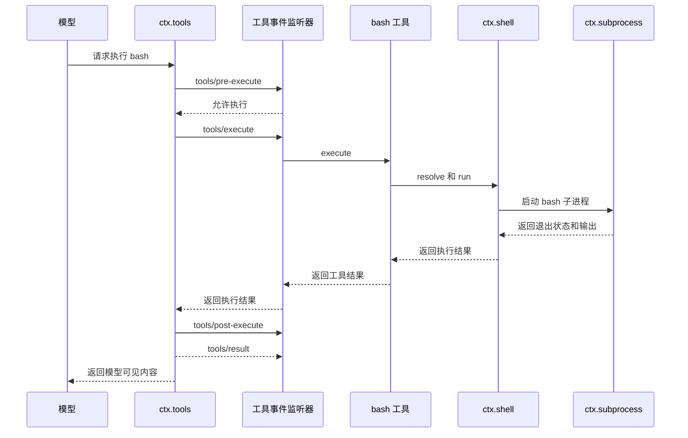
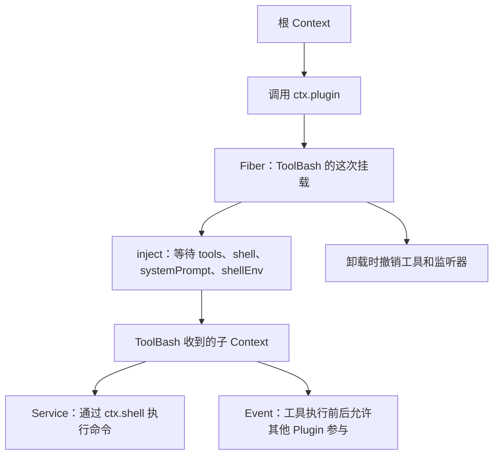

# 01：Cordis 核心心智模型

这一篇只回答一个问题：DeepSeek Harness 里的插件是怎样被装载、协作和卸载的？

先不背概念。我们直接跟一次仓库中真实的 `bash` 工具调用，再把 Plugin、Context、Service、`inject`、Event 和 Fiber 逐个对上号。

## 先看一条真实链路：`bash` 工具

[`examples/headless-agent/tests/harness.ts`](../../../examples/headless-agent/tests/harness.ts) 中有一个给真实 Agent 测试使用的组合。它的核心代码是：

```ts
const ctx = new Context()

await ctx.plugin(LocalSubprocessRuntime)
await ctx.plugin(BashEnvPlugin)
await ctx.plugin(LocalBashExecutor, { cwd: workdir, timeoutMs: 30_000 })
await ctx.plugin(ToolBash)
```

这四行不是在顺序执行一次 Bash 命令，而是在组装应用：

1. `LocalSubprocessRuntime` 提供 `ctx.subprocess`，负责启动和管理子进程。
2. `BashEnvPlugin` 提供 `ctx.shellEnv`，负责收集传给命令的 Harness 环境信息。
3. `LocalBashExecutor` 依赖 `ctx.subprocess`，并把自己注册成 `ctx.shell`。
4. `ToolBash` 依赖 `ctx.tools`、`ctx.shell`、`ctx.systemPrompt` 和 `ctx.shellEnv`，然后向 `ctx.tools` 注册模型可调用的 `bash` 工具。

其中 `ctx.tools` 和 `ctx.systemPrompt` 由这段代码前面的 `mountAgentLoopTestDependencies()` 提供。真正执行命令时，调用链才是这样：



对应源码也可以直接查到：

- [`packages/shell/shell/src/index.ts`](../../../packages/shell/shell/src/index.ts) 定义 `ctx.shell` 和 `ShellExecutor` 接口。
- [`packages/shell/bash-local/src/index.ts`](../../../packages/shell/bash-local/src/index.ts) 实现 `LocalBashExecutor`，并声明 `static inject = ['subprocess']`。
- [`packages/shell/tool-bash/src/index.ts`](../../../packages/shell/tool-bash/src/index.ts) 注册 `bash` 工具，前台命令最终调用 `ctx.shell.run(...)`。
- [`packages/core/tools/src/index.ts`](../../../packages/core/tools/src/index.ts) 在工具执行前后分发 `tools/pre-execute`、`tools/post-execute` 和 `tools/result`。

下面的六个名词，都是在管理这条链路的不同部分。

## 1. Plugin：可以被装上和拆下的一段功能

Plugin 是交给 `ctx.plugin(...)` 的函数、类，或带 `apply` 方法的对象。

在上面的例子里，`LocalSubprocessRuntime`、`BashEnvPlugin`、`LocalBashExecutor` 和 `ToolBash` 都是 Plugin。它们分别拥有不同的功能，卸载时也只撤销自己注册的内容。

Plugin 的任务不是“立刻完成一次业务调用”，而是把一项功能装进应用。例如 `ToolBash` 的 `apply(ctx)` 主要做两件事：向系统提示词注册 Bash 使用说明，向 `ctx.tools` 注册 `bash` 工具。它不会在加载时就运行一条 Bash 命令。

最小的函数 Plugin 是：

```ts
import type { Context } from '@deepseek-ai/cordis'

export function apply(ctx: Context) {
  console.log('这个 Plugin 已加载')
}
```

## 2. Context：Plugin 查找能力和登记资源的入口

Context 就是 Plugin 收到的 `ctx`。它有两项核心作用：

1. **查找当前作用范围内的服务。** `ToolBash` 中的 `ctx.shell` 会解析到当前组合里的 `LocalBashExecutor`。
2. **记住注册属于谁。** `ToolBash` 通过这个 `ctx` 注册的工具和提示词片段，都属于 `ToolBash` 这次运行；它卸载时，这些注册会一起撤销。

Context 不是一个所有 Plugin 共用的普通全局对象。每次 `ctx.plugin(...)` 都会创建一个 Fiber，Fiber 再从父 Context 派生出这次运行使用的子 Context。子 Context 可以找到父级服务，但自己的注册仍有明确的所有者。

因此，不要把 `ctx.shell` 理解成“读全局变量”。它的准确含义是：“在这个 Plugin 所在的 Context 中，查找名为 `shell` 的服务。”

### 为什么不让所有 Plugin 直接使用同一个 Context

父 Context 和子 Context 同时解决“看得见什么”和“新增内容属于谁”两个问题。

在 `ToolBash` 加载前，父 Context 里已经可以解析 `ctx.tools`、`ctx.shell`、`ctx.systemPrompt` 和 `ctx.shellEnv`。Cordis 为 `ToolBash` 创建子 Context 后，子 Context 可以继续使用这些父级 Service，无需复制一份服务实例。

同时，`ToolBash` 通过子 Context 注册的 `bash` 工具和提示词片段会归属到 `ToolBash` 的 Fiber。卸载 `ToolBash` 时，Cordis 只撤销这个 Fiber 拥有的注册，不会删除其他 Plugin 注册的工具，也不会卸载父 Context 里的 `ctx.tools` 和 `ctx.shell`。

如果所有 Plugin 都直接使用根 Context，Cordis 就很难回答“这个工具、监听器或子 Plugin 是谁注册的”，也就无法在某个 Plugin 停止时只清理它自己的内容。

父子 Context 还确定嵌套 Plugin 的卸载关系：如果一个 Plugin 在自己的子 Context 中继续调用 `ctx.plugin(ChildPlugin)`，父 Plugin 卸载时，`ChildPlugin` 的 Fiber 也会随之卸载。

## 3. Service：Plugin 通过 `ctx` 直接调用的具名能力

Service 是注册在 Context 中、有固定名字的可调用能力。

`ctx.shell` 就是一个 Service。它的公开接口是 `ShellExecutor`，包含 `resolve()`、`run()` 和 `start()`。`LocalBashExecutor` 继承 `ShellExecutor`，并在构造时通过下面这行把自己注册为 `shell` 服务：

```ts
super(ctx, 'shell')
```

`ToolBash` 不需要知道 `shell` 的实现是本机进程、沙箱还是其他后端。它只调用：

```ts
const result = await ctx.shell.run(ctx.shell.resolve(request))
```

这是 Service 解决的问题：**消费者依赖一项稳定能力，而不是依赖某个具体实现。**

## 4. `inject`：声明 Plugin 启动前必须存在的 Service

`ToolBash` 的源码有这一行：

```ts
export const inject = ['tools', 'shell', 'systemPrompt', 'shellEnv']
```

它的含义是：在这四个 Service 都可用之前，Cordis 不得调用 `ToolBash.apply(ctx)`。

例如 `LocalBashExecutor` 还没有提供 `ctx.shell` 时，`ToolBash` 的 Fiber 保持 `PENDING`。它不是启动后在 `ctx.shell` 上遇到 `undefined`，也不是被永久跳过；它是等待依赖成立。

这也意味着配置文件的书写顺序不应承担依赖管理。如果一个 Plugin 没有 `shell` 就无法工作，它应当声明 `inject: ['shell']`，而不是假设“配置里的 shell 提供方总会写在我前面”。

当 `ctx.shell` 的提供方卸载时，Cordis 会先让依赖它的 `ToolBash` 停止工作。新的 `shell` 提供方出现后，`ToolBash` 再重新加载，因此不会继续使用已卸载的旧服务实例。

## 5. Event：让其他 Plugin 参与或观察一个过程

Service 是“我要请某项能力完成一件事”。Event 则是“这件事正要发生或已经发生，关心它的 Plugin 可以参与”。

一次 `bash` 工具调用会经过几个 Event：

| Event | 发生时间 | 其他 Plugin 能做什么 |
|---|---|---|
| `tools/pre-execute` | 命令尚未执行 | 允许、拒绝或要求审批。 |
| `tools/execute` | 正要调用工具实现 | 在执行外层加入超时、重试或指标统计。 |
| `tools/post-execute` | 工具已经返回 | 接受、替换、补充或阻止结果。 |
| `tools/result` | 最终结果已确定 | 记录指标、更新 UI 或做其他只读观察。 |

`ToolBash` 调用 `ctx.shell.run()` 是 Service 调用，因为它需要一个确定的执行结果。`ctx.tools` 分发 `tools/result` 是 Event，因为工具运行时不需要知道日志、UI 或遥测插件中到底有谁在监听。

Event 不是必然持久化的消息。它首先是当前进程内 Plugin 之间的协作方式；Harness 的 Session 日志是另一套用于持久事实的机制。

## 6. Fiber：一个 Plugin 某次挂载的运行记录

Plugin 和 Fiber 最容易混淆。

Fiber 不是操作系统线程，也不是 JavaScript 协程。它不会替 Plugin 并行执行业务逻辑；它是 Cordis 用来管理“这一次 Plugin 运行”的对象。

- `ToolBash` 模块是 Plugin 定义；它在磁盘上存在，不代表已经运行。
- `ctx.plugin(ToolBash)` 会创建一个 Fiber；这个 Fiber 才代表 `ToolBash` 在当前应用中的这一次挂载。

### 为什么 Plugin 不能自己记录这些状态

同一个 Plugin 定义可以被挂载多次。例如同一个 `ToolBash` 定义可以在两个 Context 中各挂载一次：

```text
ToolBash Plugin 定义
├── Fiber A：配置 A，使用 Context A 中的 shell
└── Fiber B：配置 B，使用 Context B 中的 shell
```

这两次挂载可以使用不同配置和不同 Service 实例，也可以只卸载其中一个。Plugin 定义是两者共用的代码，不能把 A 和 B 的运行状态混在模块自身上。

更重要的是，当 `ctx.shell` 的提供方消失时，Cordis 需要立即找到正在使用这个 Service 实例的 Fiber，卸载它们的当前运行内容，并让它们回到 `PENDING`。新的 `shell` 提供方出现后，Cordis 再根据 Fiber 记录的依赖关系重新加载它们。

因此 Fiber 必须是每次挂载一个，而不是每个 Plugin 定义一个。

Fiber 记住这次挂载的：

- 父 Context 和派生出的子 Context；
- 经过校验的配置；
- `inject` 依赖和当前解析到的服务提供方；
- 加载状态和正在进行的加载或卸载任务；
- 属于这次运行的清理函数。

它的常见状态是：

```text
PENDING → LOADING → ACTIVE
   ↑                    │
   └── UNLOADING ←──┘

LOADING → FAILED
任意非结束状态 → UNLOADING → DISPOSED
```

| 状态 | 含义 |
|---|---|
| `PENDING` | 必需 Service 尚未到位，暂不调用 Plugin。 |
| `LOADING` | 正在校验配置并执行 Plugin 入口。 |
| `ACTIVE` | Plugin 已加载，它注册的内容可用。 |
| `FAILED` | 配置校验或 Plugin 启动抛错。 |
| `UNLOADING` | 正在撤销注册并等待清理完成。 |
| `DISPOSED` | 这个 Fiber 已终止，不会再激活。 |

同一个 Plugin 可以被挂载多次，每次都有自己的 Fiber、Context、配置和清理任务。

## 六个角色怎样连在一起

现在再看它们的关系：



这张图的主语是 Fiber：Cordis 为 Plugin 的一次挂载创建 Fiber；Fiber 等待 `inject` 成立；成立后，Plugin 在 Fiber 的子 Context 中使用 Service、注册 Event 监听器和其他资源；Fiber 卸载时再撤销这些内容。

## Effect：把 Cordis 不认识的资源也交给 Fiber 清理

Service 注册、`ctx.on()` 事件监听和很多 Harness 注册表 API 已经会把清理动作绑定到当前 Fiber。但如果 Plugin 自己创建了 timer、socket 或 file watcher，Cordis 不知道应该怎样关闭它。这时使用 `ctx.effect()`：

### 如果不使用 Effect

下面的 Plugin 每次加载都会创建一个定时器：

```ts
import type { Context } from '@deepseek-ai/cordis'

export function apply(ctx: Context) {
  setInterval(() => console.log('执行后台任务'), 1_000)
}
```

但 Fiber 卸载时，Cordis 无法从 `setInterval()` 推断出对应的 `clearInterval()`。热重载一次后，旧定时器仍在运行，新的 Plugin 运行又创建一个定时器；多次重载后，同一任务会被重复执行，旧资源也一直无法释放。

```text
第一次加载：定时器 A 运行
第一次重载：定时器 A 和 B 同时运行
第二次重载：定时器 A、B 和 C 同时运行
```

### Effect 记录“创建”和“清理”的对应关系

`ctx.effect()` 让 Plugin 在创建资源时就提供清理函数：

```ts
import type { Context } from '@deepseek-ai/cordis'

export function apply(ctx: Context) {
  ctx.effect(() => {
    const timer = setInterval(() => console.log('执行后台任务'), 1_000)
    return () => clearInterval(timer)
  })
}
```

effect 主体在 Plugin 加载时运行，返回的清理函数称为 disposer。当 Fiber 卸载时，Cordis 调用 disposer；如果依赖恢复后 Fiber 重新加载，Plugin 会创建一个新定时器，而不是保留已终止的旧资源。

`ctx.on()` 不需要再手写 `ctx.effect()`，因为事件监听器是 Cordis 自己管理的资源，`ctx.on()` 内部已经把删除监听器的动作登记到当前 Fiber。对于 `setInterval`、WebSocket、文件 watcher 或第三方 SDK 连接，Cordis 不知道它们的关闭 API，因此 Plugin 必须通过 Effect 明确提供 disposer。

这样 Fiber 才能对“这次挂载创建了什么、离开时应该清理什么”负完整责任。

可以用三句话区分这三个概念：

- Fiber 管理这次 Plugin 运行什么时候存活。
- Context 决定这次运行能看到哪些 Service，以及新注册属于哪个 Fiber。
- Effect 记录这次运行结束时必须执行的清理动作。

## 最后用一次 `bash` 调用复述

1. 组合代码把 `LocalBashExecutor` 和 `ToolBash` 这两个 **Plugin** 交给 `ctx.plugin(...)`。
2. Cordis 分别创建 **Fiber**，并为它们派生子 **Context**。
3. `LocalBashExecutor` 等待它的 `inject: ['subprocess']`；`ToolBash` 也等待自己的 **`inject`** 列表。
4. `LocalBashExecutor` 将自己提供为 `ctx.shell` **Service**；`ToolBash` 通过 `ctx.tools` 注册 `bash` 工具。
5. 模型调用 `bash` 时，工具运行时分发 **Event** 让策略插件参与，工具本体通过 `ctx.shell` 执行命令。
6. 任一提供方、消费者或整个应用卸载时，相应 Fiber 撤销自己的服务、工具、监听器和 effect。

如果这六步能对应到上面的源码，Cordis 的核心就已经不是抽象名词了。下一篇会从一个只打印文字的 Plugin 开始，让你亲手看到 `cordis.yml` 如何创建这整套运行结构。
