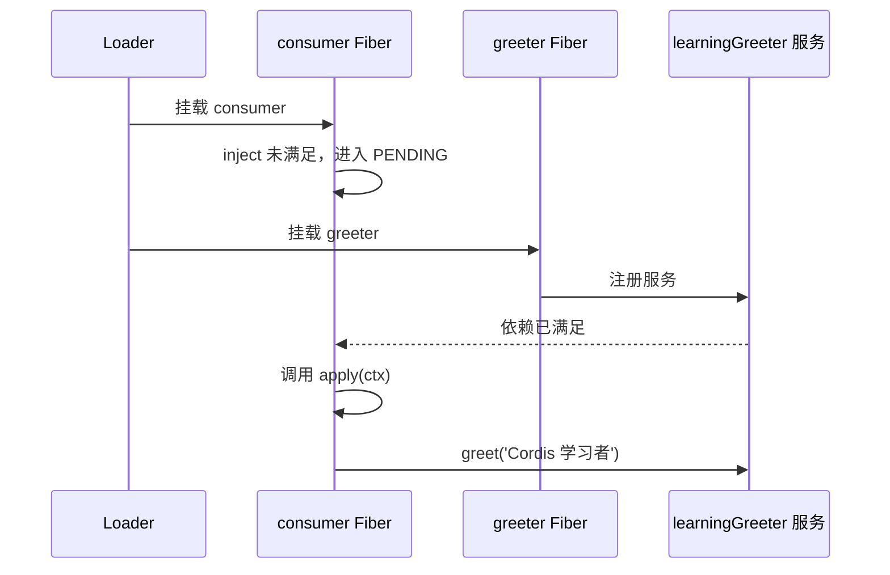
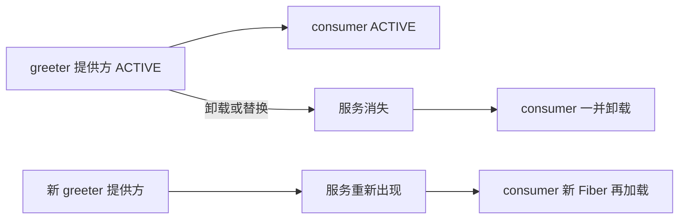

# 03：服务、依赖与上下文

上一章的插件只能打印文字，所以它不需要和任何人合作。真实应用不是这样：一个插件想发送模型请求，另一个提供 LLM；一个工具插件想读文件，另一个提供文件系统；网页插件想展示会话，另一个提供会话存储。Cordis 用“服务 + 显式依赖”处理这种合作关系。

这一章完成后，你应该能清楚地区分三件事：服务的名字是什么、服务由谁提供、消费者为什么不能只靠 YAML 排序启动。

## 服务：挂在 `ctx` 上的具名能力

服务就是其他插件可通过 `ctx.<名字>` 使用的一项能力。在 DeepSeek Harness 里，`ctx.llm` 是模型调用能力，`ctx.tools` 是工具注册和执行能力，`ctx.fs` 是文件系统能力。消费者依赖的是名字和接口，而不是某个具体 npm 包。

本章的[可运行代码](../../cordis-demos/03-services-and-context/)位于独立目录中。先从仓库根目录进入该目录：

```sh
cd leanring-project/cordis-demos/03-services-and-context
```

先做一个不依赖网络的例子。打开 `greeter.ts`：

```ts
import { Service, type Context } from '@deepseek-ai/cordis'

declare module '@deepseek-ai/cordis' {
  interface Context {
    learningGreeter: GreeterService
  }
}

export class GreeterService extends Service {
  constructor(ctx: Context) {
    super(ctx, 'learningGreeter')
  }

  greet(who: string) {
    return `你好，${who}！`
  }
}

export const name = 'learning-greeter'

export function apply(ctx: Context) {
  ctx.plugin(GreeterService)
}
```

这段代码有两个层面，最好分开理解：

| 层面 | 代码 | 它完成的事 |
|---|---|---|
| 运行时 | `super(ctx, 'learningGreeter')` | 将这个实例作为 `learningGreeter` 服务提供到当前 Context。 |
| 编译时 | `declare module ... interface Context` | 告诉 TypeScript：`ctx.learningGreeter` 是 `GreeterService`。 |

`declare module` 不会创建服务，也不会执行任何 JavaScript；它只是类型声明合并。反过来，少了它，服务在运行时也许仍然存在，但其他 `.ts` 文件无法安全地写 `ctx.learningGreeter.greet(...)`。所以可以把它理解为服务的“类型路标”，而不是服务的“安装动作”。

`Service` 类的构造函数接受 Context 和服务名。调用 `super()` 后，这个实例会注册到当前插件的生命周期中；当所属 Fiber 卸载，服务注册也会撤销。无需额外写 `delete ctx.learningGreeter`，也不应该这么做。

## 消费服务：用 `inject` 写明“开工条件”

创建 `consumer.ts`：

```ts
import type { Context } from '@deepseek-ai/cordis'
import type {} from './greeter.ts'

export const name = 'learning-greeter-consumer'
export const inject = ['learningGreeter']

export function apply(ctx: Context) {
  console.log(ctx.learningGreeter.greet('Cordis 学习者'))
}
```

`import type {} from './greeter.ts'` 看起来奇怪，但很有用：它只让 TypeScript 读取 `greeter.ts` 里的声明合并，不会在运行时主动加载这个模块。运行时究竟加载谁，仍由 `cordis.yml` 决定。

重点是 `inject`：

```ts
export const inject = ['learningGreeter']
```

它说的是：**在 `apply` 被调用前，`learningGreeter` 服务必须已经可用。** Cordis 会据此等待，不会让消费者运行在一个半初始化的环境里。现在写配置：

```yaml
- name: './consumer.ts'
- name: './greeter.ts'
```

在当前示例目录运行：

```sh
node --import tsx ../../../vendor/cordis/bin.js
```

即使消费者写在前面，运行输出仍是：

```text
你好，Cordis 学习者！
```

这不是 YAML 恰巧排对了顺序，而是 Cordis 看见 `consumer` 的 `inject` 后，先让它保持 `PENDING`，等 `greeter` 提供服务后再加载它。把两行交换，结果也一样。



## PENDING 不是异常，也不是“悄悄跳过”

把 `cordis.yml` 中的 `greeter.ts` 删除，再运行。`consumer` 不会输出，也不一定会以错误退出；它会保持 `PENDING`，因为需要的服务可能在未来由另一个动态插件提供。

这是有意的设计。若 Cordis 一发现暂时缺服务就直接崩溃，动态加载、热重载和可替换提供方都很难成立。代价是：初学时“没有任何输出”很容易让人误判。

请用这张表排查：

| 现象 | 更可能的状态 | 第一件该做的事 |
|---|---|---|
| 有异常栈或 `ValidationError` | `FAILED` | 看异常消息，修复插件代码或配置。 |
| 没输出，`inject` 依赖也没提供 | `PENDING` | 核对服务名和提供方是否加载。 |
| 曾经可用，替换提供方后短暂停止 | 卸载后等待重载 | 检查新提供方是否提供相同服务名。 |
| `apply` 跑了却看不到预期动作 | `ACTIVE` 但业务没有触发 | 检查事件、输入和日志，而不是只盯加载状态。 |

在需要诊断时，可以枚举 `ctx.registry` 中的 Fiber，官方教程的[组合与 HMR 章节](../../../docs/cordis-tutorial/06-composition-and-hmr.zh.md#诊断始终无法加载的插件)给出了可运行的诊断代码。生产插件不要把“没有依赖”偷偷吞掉；要么用 `inject` 声明硬依赖，要么明确说明它是可选能力。

## 服务消失后，消费者为什么会一起停

现在想象 `learningGreeter` 的实现被热替换。若消费者仍继续保存旧实例，很可能会调用已经释放资源的对象。Cordis 因此持续跟踪 `inject` 关系：提供方卸载时，依赖它的消费者也会卸载；同名服务重新出现后，消费者再在新 Context 中重新加载。



这就是为什么不要把 `ctx.learningGreeter` 偷偷塞到模块级变量里。模块变量不会随着 Fiber 重建而更新，也绕过了 Cordis 的生命周期管理。把调用放在插件的运行范围内，依赖关系才能真的保护你。

## 硬依赖与可选依赖

不是每项依赖都要写进 `inject`。判断依据不是“我用到了它”，而是“没有它时这个插件还能不能正确完成自己的核心职责”。

### 硬依赖：没有它就不该启动

```ts
export const inject = ['learningGreeter']

export function apply(ctx: Context) {
  console.log(ctx.learningGreeter.greet('世界'))
}
```

这里没有 `learningGreeter` 就无法工作，使用 `inject` 是诚实的表达。

### 可选依赖：缺失时仍有合理行为

```ts
export function apply(ctx: Context) {
  const greeter = ctx.get('learningGreeter')
  console.log(greeter?.greet('世界') ?? '暂时没有问候服务，但应用仍可继续。')
}
```

`ctx.get()` 用服务名查询，缺失时得到 `undefined`。选择可选依赖时，必须把缺失后的行为想清楚：是降级输出、跳过某个附加功能，还是记录一条诊断信息？不要为了“插件能启动”而吞掉一个本来会破坏核心功能的缺失。

## 服务命名：从第一次就避免冲突

服务名在一个应用的可见作用范围内是共享的。`tools`、`llm`、`sessions` 这类通用名字已经属于 Harness 的公共能力；练习或自有扩展请使用清楚的前缀，如 `learningGreeter`、`acmeBilling`，或项目约定的命名方式。

服务名不是展示文案，而是依赖键。重命名它就等于同时改变提供方、所有消费者、配置的 `inject`、相关类型声明和文档。别为了“看起来更短”轻易改它。

## 回到 Harness：同一个模式，规模更大

Harness 中的 `@deepseek-ai/dsh-llm` 会声明并提供 `ctx.llm`，DeepSeek 适配器注册自己的提供方；Agent Loop 通过 `ctx.llm` 请求模型，而不是导入某个 DeepSeek HTTP 客户端。替换模型适配器时，Loop 的业务逻辑可以不动，正是因为它消费的是服务能力而不是实现细节。

同样，`ctx.tools` 是工具运行时服务。文件工具、Shell 工具等插件把工具登记给它；Agent Loop 不需要知道每一个工具包。你已经见过完整架构图时，可能觉得它很复杂；现在可以把它重新看成一张很大的“谁提供服务、谁声明依赖”的图。

下一篇处理另一个沟通方式：当插件不想也不该知道消费者是谁时，怎样用事件广播、协作或拦截。
