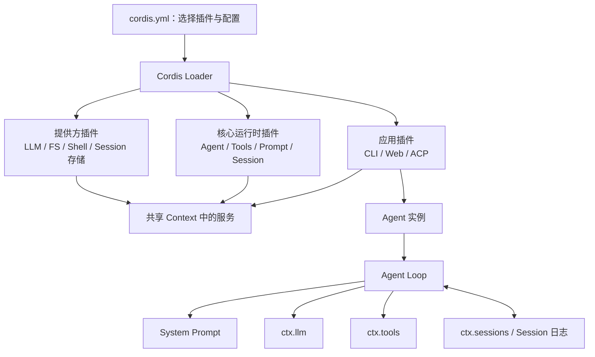
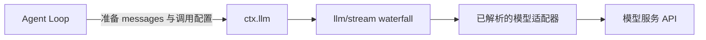
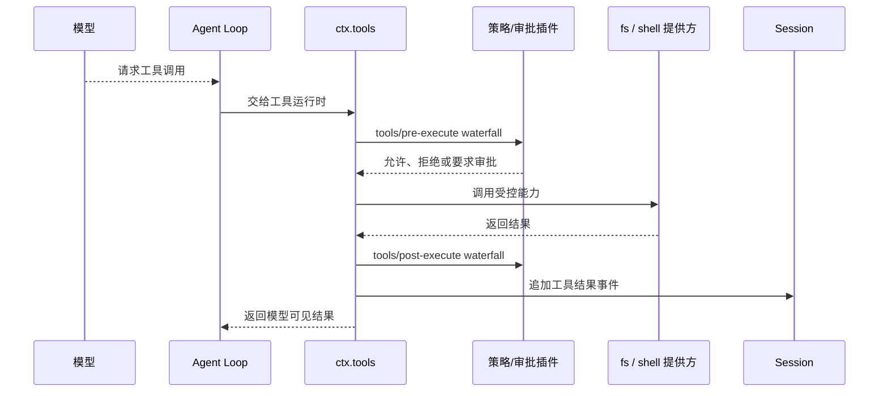

# 05：在 DeepSeek Harness 中读 Cordis

到这里，你已经知道 Cordis 的基本语言：插件提供服务，`inject` 声明硬依赖，事件让不相识的插件协作，Fiber 和 effect 保证卸载时不留残局。现在回到 DeepSeek Harness。它看上去有很多包、很多 profile、很多事件，但不需要换一套理解方式——它只是把同一套 Cordis 机制用在一个完整 Agent 上。

这一篇不是要求你立刻读完所有源码，而是给你一张“从配置走到运行时”的路线图。读到某个包时，先问它在 Cordis 中扮演什么角色，再读它的细节，会轻松得多。

## 用一张图重新看 Harness



有两层不要混：

- **Cordis 应用层**负责把插件装配起来，管理服务、事件和插件生命周期。
- **Agent 任务层**负责一次用户任务的 turn、step、模型请求、工具调用和最终回复。

前者回答“哪些能力在这次进程里存在、它们怎样替换”；后者回答“这个 Agent 此刻如何完成任务”。Agent Loop 本身也是 Cordis 组合出的能力，而不是脱离框架的特殊大脑。

## 从 profile 配置开始，而不是从某个随机类开始

推荐先打开 [`examples/headless-agent/cordis.yml`](../../../examples/headless-agent/cordis.yml)。不要试图读完每段注释；先把条目按角色分组：

| 配置中的典型条目 | Cordis 角色 | 在 Agent 中的意义 |
|---|---|---|
| `@deepseek-ai/dsh-llm-deepseek` | LLM 服务的提供方 | 把统一的模型调用接口接到 DeepSeek。 |
| `@deepseek-ai/dsh-subprocess-local`、`dsh-bash-local` | 进程与 Shell 服务提供方 | 让受控工具有地方执行命令。 |
| `@deepseek-ai/dsh-fs-local` | 文件系统服务提供方 | 把工作目录范围内的读写能力提供给工具。 |
| `@deepseek-ai/dsh-session-persistence-jsonl` | 持久化能力提供方 | 将会话事件追加保存，支持恢复与回放。 |
| `@deepseek-ai/dsh-tool-fs`、`dsh-tool-todo` | 工具消费者/注册者 | 向 `ctx.tools` 登记模型可调用的工具。 |
| `@deepseek-ai/dsh-agent-spine-demo` | 应用组装插件 | 创建示例使用的 Agent，并连接核心能力。 |

这份 YAML 的价值不在于记住包名，而在于看到“换实现不改消费者”的实际形式。例如 `dsh-fs-local` 可以被另一个满足相同 `fs` 能力的提供方替换；文件工具仍只与 `ctx.fs` 的接口协作。配置就是把选择实现的权力从业务插件挪到组合层。

## 先找服务声明：它告诉你插件之间怎样说话

看到一个新包时，优先搜索下面的形状：

```ts
declare module '@deepseek-ai/cordis' {
  interface Context {
    someService: SomeService
  }
}
```

这比从 `apply()` 开始盲读更快，因为它立刻告诉你“这个包向其他插件公开了什么”。例如：

- [`packages/llm/llm/src/index.ts`](../../../packages/llm/llm/src/index.ts) 声明 `ctx.llm: LlmRuntime`。
- [`packages/core/tools/src/index.ts`](../../../packages/core/tools/src/index.ts) 声明 `ctx.tools: ToolRuntime`。
- 会话、系统提示词、Agent 注册表等核心包也以同一模式声明各自的 Context 服务。

接着搜索该服务名的 `inject` 和 `ctx.<服务名>` 调用。你会得到一条真实的依赖路线：谁提供、谁消费、哪一些插件只是通过事件插入处理。

这是一种比“从 import 图开始追”更适合 Cordis 的阅读法。import 只告诉你代码依赖了哪些类型或辅助函数；服务名才告诉你运行时到底依赖什么能力。

## `ctx.llm`：模型提供方可替换，Loop 只面对统一能力

`@deepseek-ai/dsh-llm` 定义 LLM 运行时和 `ctx.llm` 服务。具体适配器，例如 `dsh-llm-deepseek`，登记自己负责的 provider 路由、模型信息和流式调用实现。



对学习者最有帮助的观察点有三个：

1. Agent Loop 不直接 `fetch` DeepSeek API。它通过 `ctx.llm` 请求流式结果，因此模型提供方可以替换。
2. `llm/stream` 是 waterfall 事件。重试、路由、回放等插件可以在真正流式调用的外层工作；普通协作监听器必须调用 `next()`。
3. 模型请求不是凭空拼一段字符串：系统提示词、Session 投影得到的历史消息、当前工具描述共同形成请求。任何让模型看见的新信息，都要能从会话记录或确定的投影中重建。

如果你想顺着一条真实路径读，打开 [`packages/core/agent-loop/src/agent.ts`](../../../packages/core/agent-loop/src/agent.ts)，先找 `preStep()`：它领取输入、组装系统提示词和运行时上下文，并经 `agent/pre-step` waterfall 让插件参与决定。随后再找模型请求和工具调用执行的位置。第一遍不必理解每个错误处理分支，只跟住“输入从哪里来、什么被记录、什么时候交给 `ctx.llm`”。

## `ctx.tools`：模型只能请求，运行时才真正执行

工具是 Cordis 很适合发挥作用的地方。模型能生成一个“我要调用某个工具、参数是什么”的请求，但模型不会直接拥有你的文件系统或终端。`ctx.tools` 是受控运行时：工具插件登记 schema 与执行函数，工具运行时通过事件链处理校验、审批、执行、结果和展示。



这里可以把前几篇的概念逐个对上：

- 文件系统和 Shell 是服务提供方；工具不要直接绕过它们操作宿主机。
- `tools/pre-execute`、`tools/execute`、`tools/post-execute` 是 waterfall；策略插件能包裹、拒绝或调整处理，但观察者不能漏掉 `next()`。
- `tools/result` 是 `emit`；日志、UI、遥测等可观察结果，而执行方不需要知道它们。
- 工具注册属于 lifecycle-managed effect；卸载工具插件时，它从模型可用工具列表中消失。

若你要学习如何新增工具，先看[添加工具指南](../../../docs/cookbook/adding-a-tool.zh.md)，再看一个小的既有工具包。不要先改 Agent Loop；大多数新能力都应该通过工具服务和已定义的事件扩展点接入。

## Session：不是 Cordis EventBus，而是 Agent 的持久事实记录

两种“事件”容易混淆，必须刻意分开：

| 名称 | 例子 | 用途 | 是否天然持久化 |
|---|---|---|---|
| Cordis 运行时事件 | `tools/result`、`llm/stream` | 让正在运行的插件协调或观察。 | 否；监听者只在运行时存在。 |
| Session 事件日志 | `turn/start`、用户消息、工具结果 | 保存已发生事实，供恢复、回放和模型历史投影。 | 是；可写入 JSONL 等存储。 |

Agent Loop 在任务过程中把关键事实追加到 Session：用户输入、turn 与 step 边界、模型流式内容、工具调用和结果等。下一次模型请求的历史不是从一份可随意改写的内存聊天数组取得，而是从日志投影得来。这也是《架构导读》中“模型可见 ⟺ 可从日志重建”原则的来源。

Cordis 负责把会话能力作为插件提供、把生命周期和事件连接好；Session 负责定义什么事实必须留下。两者是互补关系，不应把其中一个当成另一个的替代品。

## Scope：为什么同一个进程能有多个 Agent

你在 Agent Loop 源码里会看到 `createScope()`、`ctx.extend({ agent: this })` 之类的调用。它们利用 Context 的子作用范围，让同一进程中不同 Agent 的注册和事件监听能够隔离。一个 Agent 注册的针对性行为，不应意外影响另一个 Agent。

初学阶段把 Scope 理解为“围绕某个 Agent 再包一层工作台”就够了。它不是第二套插件框架，而是 Context 继承和过滤机制在多 Agent 场景的应用。只有你需要写会影响某个特定 Agent 的监听器、工具限制或运行时上下文时，才应深入阅读 `@deepseek-ai/dsh-scope`。

## 一次真实任务的阅读路线

当你想把静态代码变成脑中的动态流程，按这条路径跟读：

1. 从 CLI 或 Web 应用把用户消息放进 Agent 的 Inbox 开始。
2. 在 [`ReactLoopAgent`](../../../packages/core/agent-loop/src/agent.ts) 中找 `turn()` 和 `preStep()`，看它如何领取输入和写入 `turn/start`。
3. 看系统提示词和 Session 如何组成模型请求，再进入 `ctx.llm` 的流式调用。
4. 若模型要求工具，跟到 Agent Loop 的工具调用执行，再进入 `ctx.tools` 的事件流水线。
5. 看工具结果如何追加到 Session，之后为什么又会触发下一次模型请求。
6. 模型不再请求工具时，看 turn 如何结束、最终文本如何返回应用层。

每一步都问同一个问题：“这是直接服务调用、Cordis 运行时事件，还是 Session 持久事件？”能分清这三者，就不会被代码里相似的 `emit`、`append`、`register` 淹没。

## 读源码时的几个不费力原则

- 先读包的 README 和 `declare module '@deepseek-ai/cordis'`，再进实现。它们先给出服务和事件的公共入口。
- 搜索一个具体服务名或事件名，少搜索泛词如 `apply`。前者能看见真实协作关系。
- 首次阅读只画主干：输入 → Session → Prompt → LLM → Tools → Session → 回复。错误恢复、压缩、子 Agent、审批是第二轮再加入的枝干。
- 看到 `ctx.effect()`、`ctx.on()` 或注册表的 `register()`，立即问“它属于哪个 Fiber，卸载时如何撤销”。这是 Cordis 代码最关键的所有权线索。
- 看到 `inject`，立即问“缺失时是 PENDING 还是应该显式报错”。这能解释大量看似无响应的现象。

## 接下来可以做什么

最好的下一步不是重写核心，而是做一个很小、可验证的插件练习。可以任选一个：

- 做一个只观察 `tools/result` 的统计插件，输出工具名和成功次数。
- 做一个只读的 `git_status` 工具，经历 schema、注册、执行和 Session 记录的完整链路。
- 为一个现有服务写一个可替换的开发期假提供方，观察消费者因 `inject` 自动重启。

开始实现前，请回看本文的分层：直接能力用服务；协作和观察用正确模式的事件；外部资源放进 effect；模型看见的内容要有可重建的 Session 事实。掌握这些原则后，Cordis 就不再是一层“魔法底座”，而是一套可推理、可排错的插件运行时。
