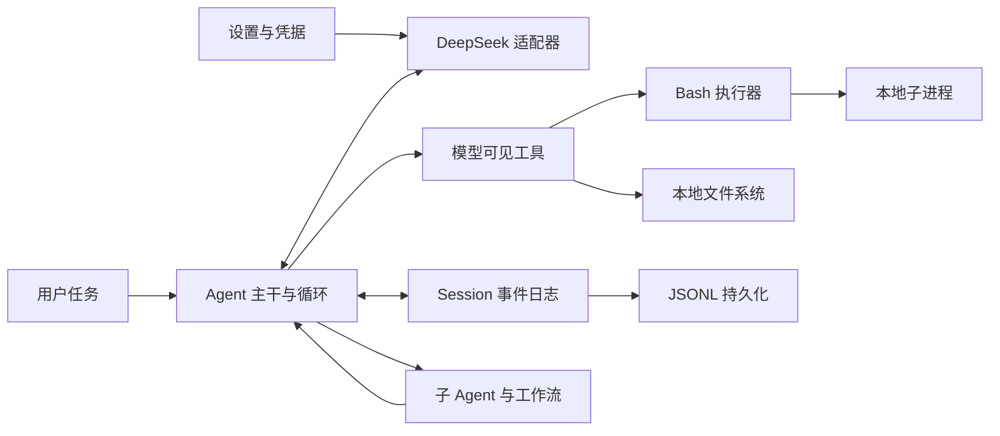

# Headless Agent `cordis.yml` 配置源码导读

这篇教程讲解 [`examples/headless-agent/cordis.yml`](../../../examples/headless-agent/cordis.yml)。读完后，你应该能回答三个问题：这份文件为什么能组装出一个 Agent；每个配置项把什么能力接进系统；模型调用 Bash、文件工具或子 Agent 时，实际经过哪些插件。

建议先读[架构导读](../架构导读.md)。如果还分不清 Plugin、Cordis 配置项、Bundle 和 Profile，再补读 [Profile、Bundle 与配置层](../profile-and-bundles/01-核心知识.md)。

## 1. 这份文件是什么

`cordis.yml` 是一份 **Cordis 插件装配清单**。它不实现 Agent 的业务逻辑，只声明“加载哪些插件实例，以及把什么配置交给它们”。Cordis Loader 读取这个数组，解析 `name` 指向的 npm 包，再调用插件导出的 `apply(ctx, config)` 或服务类。

这份 Headless 配置专门服务于仓库里的回放测试和真实模型测试：它组装了 DeepSeek 模型、本地 Bash、文件工具、会话持久化、子 Agent、工作流和待办工具，并预创建一个名为 `main` 的 Agent。它不是另一套产品入口；真正的一次性命令由 `pnpm dsh --profile headless "任务"` 启动，Profile 会从 Bundle 和用户 patch 组合最终配置。这个区别也写在 [Headless 示例说明](../../../examples/headless-agent/README.zh.md)中。

可以把这份文件理解成一张“接线图”：



这里没有一个包独自等于“完整 Agent”。模型、循环、工具、存储和安全策略各自只负责一部分，组合起来才形成能工作的 Agent。

## 2. 先学会读一条配置

配置文件的顶层是 YAML 数组，每个 `-` 开始一条插件配置项：

```yaml
- id: bash
  name: '@deepseek-ai/dsh-bash-local'
  config:
    timeoutMs: 60000
```

| 字段 | 含义 |
|---|---|
| `id` | 这一次插件挂载的稳定标识，供日志、诊断和 patch 定位。它不是 npm 包名。 |
| `name` | 要加载的 npm 包或本地模块。Loader 会从该模块读取插件入口。 |
| `config` | 交给这个插件的配置对象。字段由插件自己的 `Config` 类型和运行时 schema 定义。 |

同一个 `name` 可以出现多次，只要使用不同 `id`。本文件中的 `tool-subagent` 和 `tool-subagent-fork` 就是同一个包的两个实例：前者注册 `subagent` 工具，后者注册 `subagent_fork` 工具。

没有 `config` 不代表插件没有作用，只表示采用默认值，或者这个插件根本没有可配置项。例如 `subprocess` 仍会注册本地子进程服务，`checkpoint-policy` 仍会安装持久化检查点监听器。

配置项的书写顺序主要用于表达依赖层次，不等于简单地“上一项完全启动后才执行下一项”。插件会声明自己需要的服务；服务尚未出现时，Cordis 会让插件保持等待，等依赖满足后再激活。例如 `llm-deepseek` 写在 `agent-spine` 前面，但它需要的 `ctx.llm` 由 `agent-spine` 内部的 `LlmRuntime` 提供，因此最终仍能正确接线。

### `!!js` 不是普通 YAML

配置里有三处 `!!js`：

```yaml
cwd: !!js process.cwd()
compression: !!js "process.env.DSH_SNAPSHOT === undefined ? 'zstd' : 'none'"
```

Loader 会在挂载对应配置项时计算 JavaScript 表达式，所以 `cwd` 得到启动进程的当前目录；持久化在普通运行时使用 `zstd`，在快照模式下使用便于比较的未压缩格式。`!!js` 配置拥有执行代码的能力，只能加载可信配置，不能把用户提交的任意 YAML 当成安全数据执行。准确语义见 [app-boot 文档](../../../packages/boot/app-boot/README.zh.md)。

## 3. 先分清 Package、Plugin、Service 和 Bundle

配置里的 `name` 首先是一个 **Node.js 模块说明符**。本文件使用的说明符都指向 npm package 的根导出；Loader 加载该导出，并把它当作 Cordis plugin 挂载。因此，“这是一个 npm package”和“这是一个 plugin”并不冲突：package 是代码的发布容器，plugin 是其中被 Cordis 挂载的运行单元。

Plugin 挂载后可以扮演不同角色：Service Provider 在 `ctx` 上提供能力；Consumer 使用已有服务并注册模型工具；策略插件监听事件并改变执行规则；聚合插件再挂载一组子插件。Service 则是 plugin 注册出来的运行时对象，例如 `dsh-fs-local` 是 plugin，挂载后提供的 `ctx.fs` 才是 Service。

**正式的 DSH composition bundle 不是普通 plugin。** 它的 `package.json` 必须包含 `dsh.bundle.patch`，Profile 启动时会应用该 YAML patch。Bundle 的工作是批量插入或修改 Cordis 配置项，而不是作为本文件中的一条 `name` 直接执行。按这个严格定义，本文件中的 24 个唯一 `name` 全部是 Cordis plugin，没有一个是正式 Bundle。

`@deepseek-ai/dsh-agent-spine-demo` 是最容易混淆的一项。它没有 `dsh.bundle.patch`，所以不是 Profile 使用的正式 Bundle；但它是一个**聚合型 Cordis plugin**，会在 `apply()` 中继续挂载子插件。可以把它叫“代码组合插件”或“Agent 主干”，不要把它与 `@deepseek-ai/dsh-base`、`@deepseek-ai/dsh-headless` 这类正式 Bundle 混为一谈。

### 配置中的每个 `name`

下表逐项说明 `cordis.yml` 中的全部 `name`。其中 `@deepseek-ai/dsh-tool-subagent` 出现两次，是同一个 plugin package 的两个实例。

| 配置中的 `id` | `name` 与源码 | 准确类型 | 挂载后到底做什么 |
|---|---|---|---|
| `settings` | [`@deepseek-ai/dsh-settings-file`](../../../packages/settings/settings-file/src/index.ts) | Service Provider plugin | 提供 `ctx.settings`，从 `$DSH_HOME/settings.yaml` 读取各插件的用户设置并热更新。它不直接注册模型工具。 |
| `credentials` | [`@deepseek-ai/dsh-credentials-local`](../../../packages/credentials/credentials-local/src/index.ts) | Service Provider plugin | 提供 `ctx.credentials`，把启动环境和 `$DSH_HOME/.credentials.yaml` 组成凭据存储。模型适配器通过它按引用取得 API Key。 |
| `llm-deepseek` | [`@deepseek-ai/dsh-llm-deepseek`](../../../packages/llm/llm-deepseek/src/index.ts) | LLM Adapter 注册 plugin | 使用主干提供的 `ctx.llm`，注册名为 `deepseek-official` 的 DeepSeek adapter。它把统一 LLM 请求转换成 DeepSeek API 请求，但不负责 Agent Loop。 |
| `subprocess` | [`@deepseek-ai/dsh-subprocess-local`](../../../packages/subprocess/subprocess-local/src/index.ts) | Service Provider plugin | 提供 `ctx.subprocess`，负责在宿主机创建、终止和回收进程树。它是底层进程能力，不直接出现在模型工具列表中。 |
| `bash` | [`@deepseek-ai/dsh-bash-local`](../../../packages/shell/bash-local/src/index.ts) | Service Provider plugin | 使用 `ctx.subprocess` 提供 `ctx.shell`，实现本地 `bash -c` 执行、超时和输出收集。模型可见的 `bash` 工具由 `agent-spine` 内部的 `dsh-tool-bash` 注册。 |
| `agent-spine` | [`@deepseek-ai/dsh-agent-spine-demo`](../../../packages/examples/agent-spine-demo/src/index.ts) | 聚合型 Cordis plugin，不是正式 Bundle | 挂载 Agent 必需的通用运行时、注册表、System Prompt、工具和 Agent Loop，并按配置预创建 `main` Agent。完整子插件名单见下一节。 |
| `persistence` | [`@deepseek-ai/dsh-session-persistence-jsonl`](../../../packages/session/session-persistence-jsonl/src/index.ts) | Service Provider plugin | 提供 `ctx.sessionPersistence`，把 Session 的追加式事件日志持久化为 JSONL 或压缩 JSONL 文件。 |
| `checkpoint-policy` | [`@deepseek-ai/dsh-session-checkpoint-policy`](../../../packages/session/session-checkpoint-policy/src/index.ts) | 事件策略 plugin | 不提供新 Service；监听模型请求、工具执行和 step 边界，在外部副作用发生前刷新 Session 持久化。 |
| `token-meter` | [`@deepseek-ai/dsh-token-meter`](../../../packages/llm/token-meter/src/index.ts) | Service plugin | 提供 `ctx.tokenMeter`，根据事件日志和 provider usage 估算上下文 token 压力，并可注册 token 相关 Session Projection。 |
| `compaction-basic` | [`@deepseek-ai/dsh-compaction-basic`](../../../packages/compaction/compaction-basic/src/index.ts) | Service Provider 与自动策略 plugin | 提供 `ctx.compaction`，并在 `agent/pre-step` 等事件上检查压力；达到阈值后用模型摘要旧历史。 |
| `session-projection` | [`@deepseek-ai/dsh-session-projection`](../../../packages/session/session-projection/src/index.ts) | Service 与注册表 plugin | 提供 `ctx.sessionProjections`，让其他插件把事件流折叠成待办、token 压力、子 Agent 身份等当前状态。它本身不决定具体投影内容。 |
| `subagent` | [`@deepseek-ai/dsh-subagent`](../../../packages/subagent/subagent/src/index.ts) | 核心 Service plugin | 提供 `ctx.subagents`，保存 provider 注册表，并管理子 Agent 启动、继续、汇报、中断和生命周期。它只定义统一运行能力，不决定具体怎样创建子 Agent。 |
| `subagent-spawn-in-process` | [`@deepseek-ai/dsh-subagent-spawn-in-process`](../../../packages/subagent/subagent-spawn-in-process/src/index.ts) | Subagent Provider 注册 plugin | 向 `ctx.subagents` 注册 `spawn` provider；在同一进程内创建拥有新 Session、没有父对话历史的子 Agent。 |
| `subagent-fork-in-process` | [`@deepseek-ai/dsh-subagent-fork-in-process`](../../../packages/subagent/subagent-fork-in-process/src/index.ts) | Subagent Provider 注册 plugin | 向 `ctx.subagents` 注册 `fork` provider；在同一进程内创建子 Agent，并复制父 Session 最近一个完整 turn 以前的历史。 |
| `tool-subagent-control` | [`@deepseek-ai/dsh-tool-subagent-control`](../../../packages/subagent/tool-subagent-control/src/index.ts) | 模型工具 Consumer plugin | 使用 `ctx.subagents` 和 `ctx.tools`，注册全局 `send_message` 与 `interrupt_agent` 工具。它不创建新的 provider。 |
| `tool-subagent-report` | [`@deepseek-ai/dsh-tool-subagent-report`](../../../packages/subagent/tool-subagent-report/src/index.ts) | 子 Agent 局部工具贡献 plugin | 向 `ctx.subagents` 登记“可继续子 Agent 的创建设置”；创建这类子 Agent 时，只在子 Agent 局部上下文注册 `report` 工具和对应提示词。 |
| `tool-subagent` | [`@deepseek-ai/dsh-tool-subagent`](../../../packages/subagent/tool-subagent/src/index.ts) | 模型工具 Consumer plugin | 把 `spawn` provider 暴露成模型可见的 `subagent` 工具；本实例采用可继续的后台模式。 |
| `tool-subagent-fork` | [`@deepseek-ai/dsh-tool-subagent`](../../../packages/subagent/tool-subagent/src/index.ts) | 同一 Consumer plugin 的第二个实例 | 把 `fork` provider 暴露成 `subagent_fork` 工具；本实例只能前台、一次性执行。`id` 和 `toolName` 不同，所以能与上一实例共存。 |
| `workflow-worker-thread` | [`@deepseek-ai/dsh-workflow-worker-thread`](../../../packages/workflow/workflow-worker-thread/src/index.ts) | Service Provider plugin | 提供 `ctx.workflowEngine`，在 worker thread 中运行模型编写的工作流脚本，并把脚本的 `agent()` 调用交给 `spawn` provider。 |
| `tool-workflow` | [`@deepseek-ai/dsh-tool-workflow`](../../../packages/workflow/tool-workflow/src/index.ts) | 模型工具 Consumer plugin | 使用 `ctx.workflowEngine` 注册模型可见的 `workflow` 工具，并把运行过程写成 Session 事件。 |
| `tool-ralph` | [`@deepseek-ai/dsh-tool-ralph`](../../../packages/workflow/tool-ralph/src/index.ts) | 模型工具 Consumer plugin | 使用 workflow 与 subagent 服务注册 `ralph` 工具，按固定脚本反复启动全新的结构化输出子 Agent。 |
| `tool-todo` | [`@deepseek-ai/dsh-tool-todo`](../../../packages/todo/tool-todo/src/index.ts) | 模型工具与投影贡献 plugin | 注册 `todo_write`，把整份待办列表写入 `todo/write` Session 事件；存在 Projection 服务时还注册当前待办投影。 |
| `fs-local` | [`@deepseek-ai/dsh-fs-local`](../../../packages/fs/fs-local/src/index.ts) | Service Provider plugin | 提供 `ctx.fs`，在宿主文件系统上实现读取、写入、编辑和版本检查。`cwd` 只用于解析相对路径。 |
| `fs-observation-policy` | [`@deepseek-ai/dsh-fs-observation-policy`](../../../packages/fs/fs-observation-policy/src/index.ts) | 事件策略 plugin | 不提供新 Service；监听 `fs/*` 事件，记录每个 Agent 观察过的文件版本，并要求编辑基于已观察版本。 |
| `tool-fs` | [`@deepseek-ai/dsh-tool-fs`](../../../packages/fs/tool-fs/src/index.ts) | 模型工具 Consumer plugin | 使用 `ctx.fs` 和 `ctx.tools` 注册 `read`、`write`、`edit`；组合了 attachment 服务时再注册 `read_image`。 |

### `agent-spine-demo` 实际包含哪些子插件

这里的“包含”不是 package 依赖清单，而是当前配置下 [`apply()`](../../../packages/examples/agent-spine-demo/src/index.ts) 实际执行的 `ctx.plugin(...)`。这些子插件与 `agent-spine` 共用一棵 Cordis 生命周期树：卸载聚合插件时，子插件也会一起释放。

| 子插件 | 在主干中的作用 |
|---|---|
| `@deepseek-ai/cordis-plugin-timer` | 提供 Cordis timer 服务。 |
| `@deepseek-ai/dsh-llm` | 提供统一的 `ctx.llm` 注册表和 LLM 数据类型；具体 DeepSeek adapter 仍由顶层 `llm-deepseek` 提供。 |
| `@deepseek-ai/dsh-session` | 提供内存中的 Session 事件日志与 Session Store。 |
| `@deepseek-ai/dsh-session-title` | 提供基于日志的标题服务和确定性后备标题。 |
| `@deepseek-ai/dsh-system-prompt` | 组装 System Prompt 段、变量和工具 schema。 |
| `@deepseek-ai/dsh-tools` | 提供 `ctx.tools` 注册表和受控工具执行流水线。 |
| `@deepseek-ai/dsh-skill` | 提供 Skill Provider 注册表。 |
| `@deepseek-ai/dsh-skill-filesystem` | 从本地文件系统发现 Skill。当前配置没有关闭 `skills`，所以会挂载。 |
| `@deepseek-ai/dsh-agent` | 提供 `ctx.agents` 注册表、Agent 作用域与 `agent/*` 事件。 |
| `@deepseek-ai/dsh-llm-retry` | 在 provider 请求失败时执行路由感知的重试策略。 |
| `@deepseek-ai/dsh-jobs-local` | 提供进程内后台 Job 注册表。 |
| `@deepseek-ai/dsh-invariants` | 提供运行时关系不变量注册表。 |
| `@deepseek-ai/dsh-session/invariant` | 注册 Session 关系检查。 |
| `@deepseek-ai/dsh-agent/invariant` | 注册 Agent 关系检查。 |
| `@deepseek-ai/dsh-scope/invariant` | 注册 Agent 作用域关系检查。 |
| `@deepseek-ai/dsh-agent-loop/invariant` | 注册 Agent Loop 关系检查。 |
| `@deepseek-ai/dsh-shell-env` | 把 Harness 相关环境信息加入 Bash 执行上下文。 |
| `@deepseek-ai/dsh-tool-bash` | 注册模型可见的 `bash` 工具；真正执行命令的是顶层 `bash-local`。 |
| `@deepseek-ai/dsh-agent-instructions` | 读取 `AGENTS.md`、`CLAUDE.md` 等 workspace 指令并送入模型上下文。 |
| `@deepseek-ai/dsh-tool-skill` | 把 Skill 目录和加载工具暴露给模型。 |
| `@deepseek-ai/dsh-tool-jobs` | 注册 `job_output`、`job_list`、`job_kill` 等后台任务控制工具。 |
| `@deepseek-ai/dsh-agent-loop` | 提供具体 Agent Loop，并消费 `agents` 配置创建 `main`。 |

主干还支持三个可选子插件：`@deepseek-ai/dsh-goal`、`@deepseek-ai/dsh-tool-goal` 和 `@deepseek-ai/dsh-goal-round-driver`。只有 `agent-spine.config.goals` 被显式配置且不为 `false` 时才挂载；当前 `cordis.yml` 没有 `goals`，所以它们不属于本次实际组合。

主干有意不包含具体 LLM adapter、Bash executor、子进程 Provider、文件系统 Provider、Session 持久化 Provider 和应用入口。这些实现需要由当前运行环境选择，所以它们作为本文件的顶层兄弟 plugin 出现。

### 正式 Headless Profile 中的 Bundle

虽然本示例配置没有 Bundle，产品命令 `dsh --profile headless` 确实使用两个正式 Bundle：`@deepseek-ai/dsh-base` 和 `@deepseek-ai/dsh-headless`。它们的 `package.json` 都声明了 `dsh.bundle.patch`。

`@deepseek-ai/dsh-base` 的 [`cordis.patch.yml`](../../../packages/bundle/base/cordis.patch.yml) 插入通用模型、Session、设置、凭据、持久化、沙箱、文件系统、Shell、工具、子 Agent、工作流、压缩、技能和 Agent Loop 等配置项。它比教学用的 `agent-spine-demo` 更完整，也带有产品使用的安全与交互策略。

`@deepseek-ai/dsh-headless` 的 [`cordis.patch.yml`](../../../packages/bundle/headless/cordis.patch.yml) 叠加在 base 之上：修改已有的 `system-prompt`、`hmr` 和 `tools` 配置，并插入三个 plugin——`@deepseek-ai/dsh-code-runtime-worker-thread`、`@deepseek-ai/dsh-headless/startup`、`@deepseek-ai/dsh-headless`。最后一项是一次性 runner，负责创建 Agent、提交命令行任务、等待 Session 刷新、输出最终回答并退出。

这里还能看出一个细节：同一个 npm package 可以同时参与两种角色。`@deepseek-ai/dsh-headless` package 用 `dsh.bundle.patch` 声明正式 Bundle；它的根导出和 `/startup` 子路径又分别是能被 patch 插入配置树的 Cordis plugin。

## 4. 用户设置、凭据与模型

### `settings`：可热更新的用户设置

```yaml
- id: settings
  name: '@deepseek-ai/dsh-settings-file'
```

这个插件默认读取 `$DSH_HOME/settings.yaml`，并监听文件变化。配置中的 `llm-deepseek:` 段可以覆盖当前 DeepSeek 适配器设置，无需重启。源码中的 [`resolveSpec()`](../../../packages/settings/settings-file/src/index.ts)把缺省路径解析为 Harness home 下的 `settings.yaml`，并把 `watch` 默认为 `true`。

### `credentials`：密钥来源

```yaml
- id: credentials
  name: '@deepseek-ai/dsh-credentials-local'
```

这个插件把启动进程环境与 `$DSH_HOME/.credentials.yaml` 组成凭据服务；凭据文件也支持热更新，并要求只有文件所有者可以访问。DeepSeek 适配器在每次请求时解析 `DEEPSEEK_API_KEY`，所以 API Key 不需要、也不应该写进 `cordis.yml`。默认路径和监听行为在 [`credentials-local`](../../../packages/credentials/credentials-local/src/index.ts) 的 `Config` 与 `resolveSpec()` 中定义。

### `llm-deepseek`：把统一 LLM 接口接到 DeepSeek

```yaml
- id: llm-deepseek
  name: '@deepseek-ai/dsh-llm-deepseek'
  config:
    thinking: enabled
    reasoningEffort: max
    models:
      - id: deepseek-v4-pro
        contextWindow: 128000
      - id: deepseek-v4-flash
        contextWindow: 128000
```

| 配置项 | 作用 |
|---|---|
| `thinking: enabled` | 允许请求使用思考模式。设为 `disabled` 会把每次会话请求限制为关闭思考。 |
| `reasoningEffort: max` | 未被单次请求覆盖时，默认采用最高思考强度。可选值还有 `off`、`low`、`high`。 |
| `models` | 适配器公布的模型目录，供选择器和精确模型解析使用。 |
| `models[].id` | 服务端接受的模型标识。本例的 `main.model` 选择了目录中的 `deepseek-v4-flash`。 |
| `models[].contextWindow` | 该模型一次请求与响应合计可使用的上下文容量，单位是 token。Token 计量和压缩策略会使用它。 |

适配器本身只依赖统一的 `ctx.llm` 服务，并以 `deepseek-official` 注册 provider 路由。它在真正发起请求前再读取设置与凭据。实现入口是 [`llm-deepseek/src/index.ts`](../../../packages/llm/llm-deepseek/src/index.ts)，真正的网络适配器在 [`adapter.ts`](../../../packages/llm/llm-deepseek/src/adapter.ts)。

一个容易误解的点是：`models` 不是“启动时同时加载两个模型”。它是一份可选模型目录；本配置中的 `main` Agent 明确选择 `deepseek-v4-flash`，一次请求只走选中的模型。

## 5. 本地命令执行链

```yaml
- id: subprocess
  name: '@deepseek-ai/dsh-subprocess-local'

- id: bash
  name: '@deepseek-ai/dsh-bash-local'
  config:
    timeoutMs: 60000
```

这两层故意拆开：

```text
模型调用 bash 工具
  → agent-spine 内置的 dsh-tool-bash
  → ctx.shell：dsh-bash-local
  → ctx.subprocess：dsh-subprocess-local
  → 操作系统进程
```

`subprocess-local` 负责创建、终止和回收整个本地进程树，也负责 stdout/stderr 管道；它没有配置，因为超时和输出上限由上层调用者决定。实现见 [`LocalSubprocessRuntime`](../../../packages/subprocess/subprocess-local/src/index.ts)。

`bash-local` 把命令转成 `bash -c`，并通过 `ctx.subprocess` 执行。这里的 `timeoutMs: 60000` 把默认前台命令超时设为 60 秒；单次调用即使要求更久，也不能超过插件的 `maxTimeoutMs`。它还会关闭颜色和分页器，避免终端控制字符污染模型看到的输出。字段定义见 [`bash-local` 的 `Config`](../../../packages/shell/bash-local/src/index.ts)。

## 6. `agent-spine`：主干聚合插件

```yaml
- id: agent-spine
  name: '@deepseek-ai/dsh-agent-spine-demo'
  config:
    agents:
      - id: main
        provider: deepseek-official
        model: deepseek-v4-flash
        cwd: !!js process.cwd()
    workspaceContext:
      maxBytes: 65536
    persona: |
      You are headless-agent, a coding assistant powered by the {{model}} model.

      Verify your work by running the code or tests. Keep answers brief and
      factual.
```

这是整份配置最重要的一项。`agent-spine-demo` 不是单一服务，而是给示例使用的“主干插件”：它内部继续挂载 LLM 通用运行时、Session、System Prompt、工具注册表、技能系统、Agent 注册表、重试、后台任务、运行时不变量、Bash 工具、workspace 指令加载器、Job 工具和 Agent Loop。源码中的 [`apply()`](../../../packages/examples/agent-spine-demo/src/index.ts)直接展示了这层展开关系：

```text
ctx.plugin(LlmRuntime)
ctx.plugin(SessionStore)
ctx.plugin(SystemPrompt, ...)
ctx.plugin(ToolRuntime, ...)
ctx.plugin(AgentRegistry)
ctx.plugin(toolBash, ...)
ctx.plugin(workspaceContext, ...)
ctx.plugin(AgentLoop, ...)
```

因此，不能只按 `cordis.yml` 的行数判断系统有多少插件。`agent-spine` 这一行下面还藏着一棵子插件树。仓库生成的[完整装配图](../../../examples/headless-agent/composition.md)列出了叶配置中的插件，`agent-spine` 源码则是理解其内部插件的权威来源。

### `agents`

| 配置项 | 作用 |
|---|---|
| `id: main` | 启动时预创建的 Agent 标签，也会参与新 Session 标识与日志。 |
| `provider: deepseek-official` | 选择 `llm-deepseek` 注册的 provider 路由。 |
| `model: deepseek-v4-flash` | 选择具体模型。此示例固定使用 Flash，以保持回放语料的模型选择稳定。 |
| `cwd: !!js process.cwd()` | 把当前启动目录记录为这个 Session 的工作目录；相对文件路径和 workspace 指令发现都以它为重要输入。 |

Agent Loop 的 `agents` 配置还支持 `sessionId`、`resumeSessionId` 和单 Agent 的 `maxTokens`，但这个示例只需要创建一个全新 Agent。准确字段见 [`agent-loop` 的 `Config`](../../../packages/core/agent-loop/src/index.ts)。

### `workspaceContext.maxBytes`

`65536` 表示一次写入模型上下文的 workspace 指令最多 65,536 个 UTF-8 字节。指令加载器从 Agent 的 `cwd` 向上寻找项目根目录，并读取 `AGENTS.md`、`CLAUDE.md` 及本地覆盖文件；文件工具触及新的子目录后，它还会把相关嵌套指令送入后续步骤。实现见 [`agent-instructions`](../../../packages/context/agent-instructions/src/index.ts) 和它的 [`Config`](../../../packages/context/agent-instructions/src/config.ts)。

### `persona`

`persona` 是部署给模型的角色说明，会进入 System Prompt。`{{model}}` 由 System Prompt 的变量机制替换为当前模型名。这里还要求 Agent 用代码或测试验证工作，并保持回答简短、基于事实。

YAML 的 `|` 表示保留换行的多行字符串；这不是 Cordis 特有语法。

## 7. Session 持久化与长上下文

这一组插件解决两个问题：进程退出后如何恢复历史，以及历史接近模型容量时如何继续工作。

### `persistence`

```yaml
- id: persistence
  name: '@deepseek-ai/dsh-session-persistence-jsonl'
  config:
    root: './.sessions'
    compression: !!js "process.env.DSH_SNAPSHOT === undefined ? 'zstd' : 'none'"
```

`root` 是所有 Session 文件的根目录；相对路径最终落在本次运行环境解析出的 `./.sessions`。每个 Session 的追加式事件日志都写入自己的目录。`compression` 在普通运行中使用带校验的 Zstandard 帧，在快照模式使用 `none`，让测试产物保持可直接比较。实现与完整字段见 [`session-persistence-jsonl`](../../../packages/session/session-persistence-jsonl/src/index.ts)。

### `checkpoint-policy`

这个无配置插件在三个关键位置刷新持久化数据：模型请求发出前、顶层工具真正执行前、下一步开始前。如果刷新失败，模型请求或有副作用的工具不会继续执行。它避免出现“命令已经改了外部状态，但对应工具调用还没写入日志”的不一致。源码见 [`session-checkpoint-policy`](../../../packages/session/session-checkpoint-policy/src/index.ts)。

### `token-meter` 与 `compaction-basic`

`token-meter` 根据 Session 事件和模型返回的 token usage 估算当前上下文压力。它没有用户配置；拼错或多写字段会直接报错。

```yaml
- id: compaction-basic
  name: '@deepseek-ai/dsh-compaction-basic'
  config:
    thresholdRatio: 0.8
    retainRatio: 0.16
    maxTokens: 8192
    compactionRetries: 1
```

| 配置项 | 作用 |
|---|---|
| `thresholdRatio: 0.8` | 预计请求占用达到模型上下文容量的 80% 时，触发自动压缩。 |
| `retainRatio: 0.16` | 压缩旧历史时，保留靠近末尾的 16% 作为原文，其余较旧范围由摘要接替。 |
| `maxTokens: 8192` | 压缩摘要请求允许生成的最大 token 数。 |
| `compactionRetries: 1` | 摘要没有把上下文压到目标范围时，再重试一次压缩。 |

`BasicCompactionEngine` 在 `agent/pre-step` 等扩展点检查压力，所以压缩是 Agent Loop 外围的插件行为，不是写死在循环里的分支。默认值与校验集中在 [`compaction-basic/src/config.ts`](../../../packages/compaction/compaction-basic/src/config.ts)。

## 8. Session Projection 与子 Agent

### 三层职责

子 Agent 相关配置看起来最多，是因为它把“统一接口”“具体后端”和“模型可见工具”分开了：

```text
dsh-subagent                         统一运行时和 provider 注册表
  ├─ dsh-subagent-spawn-in-process  新建空白上下文的子 Agent
  └─ dsh-subagent-fork-in-process   继承父会话已完成轮次的子 Agent

dsh-tool-subagent                   把某个 provider 暴露成模型工具
dsh-tool-subagent-control           send_message / interrupt_agent
dsh-tool-subagent-report            子 Agent 的 report 工具
```

`session-projection` 提供通用投影注册表：插件可以把追加式 Session 事件折叠成“当前待办”“子 Agent 身份”“token 压力”等便于读取的状态。子 Agent 目录读取依赖这项能力；配置缺失时会明确失败，而不是静默返回空结果。实现见 [`session-projection`](../../../packages/session/session-projection/src/index.ts)。

### `spawn` 与 `fork`

| 配置项 | 实例含义 |
|---|---|
| `subagent-spawn-in-process.providerName: spawn` | 注册名为 `spawn` 的后端。子 Agent 使用自己的 Session，从空白会话开始，不继承父对话。 |
| `subagent-fork-in-process.providerName: fork` | 注册名为 `fork` 的后端。子 Agent 复制父 Session 到最近一个完整 `turn/end` 为止，不包含当前尚未完成的工具调用轮次。 |

两者都在同一个 Node.js 进程和 Cordis 组合中运行，所以这里的 “in-process” 描述运行位置；“spawn/fork” 描述会话历史从哪里开始。可对照 [`spawn` 实现](../../../packages/subagent/subagent-spawn-in-process/src/index.ts)与 [`fork` 实现](../../../packages/subagent/subagent-fork-in-process/src/index.ts)。

### 两个 `dsh-tool-subagent` 实例

```yaml
- id: tool-subagent
  name: '@deepseek-ai/dsh-tool-subagent'
  config:
    provider: spawn
    toolName: subagent
    backgroundMode: continuable
    maxDepth: 1

- id: tool-subagent-fork
  name: '@deepseek-ai/dsh-tool-subagent'
  config:
    provider: fork
    toolName: subagent_fork
    backgroundMode: one-shot
    enableRunInBackground: false
    maxDepth: 1
```

| 配置项 | 作用 |
|---|---|
| `provider` | 选择前面注册的子 Agent 后端。名称必须匹配。 |
| `toolName` | 模型在工具列表里看到的名字。同一组合中的每个实例必须不同。 |
| `backgroundMode: continuable` | 子 Agent 默认在后台运行，返回持久的子 Agent id；以后可继续同一段子对话。 |
| `backgroundMode: one-shot` | 一次性执行，默认前台等待结果。 |
| `enableRunInBackground: false` | 从 `subagent_fork` 的 schema 中移除后台开关，并拒绝强行发起后台调用。 |
| `maxDepth: 1` | 当前 Agent 可以创建一层子 Agent；子 Agent 再尝试委派会因为深度上限被拒绝。 |

`tool-subagent-control` 全局注册 `send_message` 和 `interrupt_agent`：前者为可继续的后台子 Agent 排入下一轮消息，后者请求中断目标当前轮次。`tool-subagent-report` 只在可继续子 Agent 的局部上下文中安装 `report`，让子 Agent 主动向父 Agent 汇报；默认投递策略是 `next-step`，会唤醒父 Agent 并在最近的步骤边界送达。相关实现分别位于 [`tool-subagent-control`](../../../packages/subagent/tool-subagent-control/src/index.ts)、[`tool-subagent-report`](../../../packages/subagent/tool-subagent-report/src/index.ts)和 [`tool-subagent`](../../../packages/subagent/tool-subagent/src/index.ts)。

## 9. Workflow、Ralph 与 Todo

### `workflow-worker-thread` 与 `tool-workflow`

```yaml
- id: workflow-worker-thread
  name: '@deepseek-ai/dsh-workflow-worker-thread'
  config:
    provider: spawn

- id: tool-workflow
  name: '@deepseek-ai/dsh-tool-workflow'
```

`workflow-worker-thread` 提供工作流执行引擎。模型编写一段受限格式的 JavaScript 编排脚本，脚本里的 `agent()` 调用通过 `spawn` provider 扇出为多个子 Agent；worker thread 避免同步脚本阻塞主线程，也允许强制终止，但源码明确说明它是运行隔离，不是安全沙箱。`tool-workflow` 再把引擎暴露成模型可见的 `workflow` 工具。实现见 [`workflow-worker-thread`](../../../packages/workflow/workflow-worker-thread/src/index.ts)与 [`tool-workflow`](../../../packages/workflow/tool-workflow/src/index.ts)。

### `tool-ralph`

Ralph 是固定流程的多轮执行器：每一轮都启动一个全新的 `spawn` 子 Agent，通过结构化报告把目标、上一轮交接信息和完成状态传给下一轮，直到完成、阻塞或达到轮数上限。它适合用户明确要求的 Ralph loop，不是普通任务的默认循环。源码见 [`tool-ralph`](../../../packages/workflow/tool-ralph/src/index.ts)。

### `tool-todo`

```yaml
- id: tool-todo
  name: '@deepseek-ai/dsh-tool-todo'
  config:
    allowParallelInProgress: true
```

它注册 `todo_write` 工具。每次调用必须提交完整列表，并整体替换上一版，而不是逐项修改。`allowParallelInProgress: true` 允许多个事项同时处于 `in_progress`，与子 Agent 和工作流的并行执行方式一致；如果设为 `false`，一次写入多个进行中事项会被拒绝。每次列表变化都会记录成 `todo/write` Session 事件，源码见 [`tool-todo`](../../../packages/todo/tool-todo/src/index.ts)。

## 10. 文件系统：Provider、策略和工具

```yaml
- id: fs-local
  name: '@deepseek-ai/dsh-fs-local'
  config:
    cwd: !!js process.cwd()

- id: fs-observation-policy
  name: '@deepseek-ai/dsh-fs-observation-policy'

- id: tool-fs
  name: '@deepseek-ai/dsh-tool-fs'
```

这也是标准的三层拆分：

| 插件 | 责任 |
|---|---|
| `fs-local` | 实现 `ctx.fs`，真正读写宿主机文件。`cwd` 只是相对路径的解析基准。 |
| `fs-observation-policy` | 记录每个 Agent 已观察到的文件版本，决定写入和编辑应使用什么版本保护。 |
| `tool-fs` | 向模型注册 `read`、`write`、`edit`；组合中另有 attachment 服务时才注册 `read_image`。 |

`fs-observation-policy` 带来“先观察再修改”的语义：`edit` 必须先读过目标文件；`write` 对已存在文件使用观察到的版本，文件在读取后被别人修改时会拒绝陈旧写入。策略源码在 [`fs-observation-policy`](../../../packages/fs/fs-observation-policy/src/index.ts)，工具注册在 [`tool-fs`](../../../packages/fs/tool-fs/src/index.ts)。

这里有一个重要的安全边界：[`fs-local`](../../../packages/fs/fs-local/src/index.ts) 的 `cwd` **不是目录限制**，只决定相对路径从哪里解析；绝对路径仍可能指向工作区外。本示例还直接使用本地 Bash，没有组合 `bash-sandbox` 或用户审批插件。因此这是一份受信任开发与测试环境的配置，不应直接用于运行不可信任务。需要真正限制访问范围时，应组合沙箱 provider 或权限策略，而不是只修改 `cwd`。

## 11. 一次任务如何穿过这些插件

假设用户要求“读取 `package.json`，运行测试并修复失败”：

1. `agent-spine` 预创建的 `main` Agent 收到任务，Agent Loop 打开一个 turn。
2. System Prompt 合并 `persona`、workspace 中的 `AGENTS.md` 指令和模型可见工具 schema。
3. `llm-deepseek` 从设置与凭据服务解析当前连接信息，向 `deepseek-v4-flash` 发出请求。
4. 模型请求 `read` 时，`tool-fs` 通过 `fs-local` 读取文件，观察策略记住文件版本，调用与结果都写入 Session。
5. 模型请求 `bash` 时，主干内的 Bash 工具调用 `bash-local`，再由 `subprocess-local` 创建受管理的进程树。
6. `checkpoint-policy` 在有副作用的顶层工具执行前刷新 Session 日志；工具完成后，Agent Loop 把结果带入下一次模型请求。
7. 如果模型委派独立任务，`subagent` 工具通过 `spawn` 创建可继续的后台子 Agent；父 Agent 可用 `send_message` 继续它。
8. `token-meter` 持续测量上下文；达到 80% 时，`compaction-basic` 摘要较早历史并保留最近部分。
9. 模型不再请求工具后，Agent Loop 写入 `turn/end`；JSONL 持久化保存完整事件序列，入口输出最终回复并退出。

这条链路体现了 DeepSeek Harness 最关键的设计：模型只提出工具调用，Provider 执行真实操作，策略插件在扩展点上施加约束，所有模型可见事实都通过 Session 事件留下记录。

## 12. 推荐的源码阅读顺序

不要按配置文件从第一行机械读到最后一行。按一条真实请求的依赖顺序阅读更容易建立整体认识：

1. [`agent-spine-demo/src/index.ts`](../../../packages/examples/agent-spine-demo/src/index.ts)：先看 `apply()` 展开了哪些主干插件。
2. [`agent-loop/src/agent.ts`](../../../packages/core/agent-loop/src/agent.ts)：看 `ReactLoopAgent` 如何组织 turn、step、模型请求和工具结果。
3. [`llm-deepseek/src/index.ts`](../../../packages/llm/llm-deepseek/src/index.ts)：看 provider、设置和凭据如何汇合。
4. [`tool-fs/src/index.ts`](../../../packages/fs/tool-fs/src/index.ts) 与 [`fs-local/src/index.ts`](../../../packages/fs/fs-local/src/index.ts)：对照“模型工具”和“能力 Provider”的分工。
5. [`tool-subagent/src/index.ts`](../../../packages/subagent/tool-subagent/src/index.ts)：看同一个工具插件如何通过配置绑定不同 provider。
6. [`session-checkpoint-policy/src/index.ts`](../../../packages/session/session-checkpoint-policy/src/index.ts)：看一个不改 Agent Loop 的策略插件如何拦截关键操作。
7. [配置字段总表](../../../docs/config-catalog.md)：需要查询未在本示例出现的可选字段时再使用，不必一开始背完整目录。

## 13. 三个小练习

练习一：把 `main.model` 从 `deepseek-v4-flash` 改为 `deepseek-v4-pro`，并解释为什么 `provider` 不需要一起改。答案要点：provider 选择适配器路由，model 选择该路由下的具体模型。

练习二：把两个 `dsh-tool-subagent` 实例画成“工具名 → provider → 是否继承父历史 → 前台/后台”的四列表。这样能检验你是否真的理解 `id`、`name`、`toolName` 和 `provider` 不是同一层概念。

练习三：说明为什么 `fs-local.cwd`、`fs-observation-policy` 和真正的目录沙箱不能互相替代。答案要点：第一个解析相对路径，第二个防止未观察或陈旧的修改，第三个才限制可访问范围。

完成这三个练习后，再回到原始 [`cordis.yml`](../../../examples/headless-agent/cordis.yml)。如果你能把每一项归入“服务定义、Provider、模型工具、策略或组合主干”中的一类，就已经掌握了这份 Headless Agent 配置的核心。
