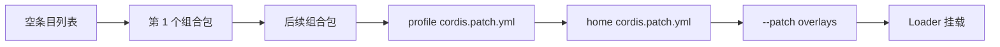

# 01：先分清 Profile、组合包、插件与 Patch

这一章只建立四个概念之间的关系。先不要把 profile 理解成一份完整 `cordis.yml`；在当前实现中，它更接近一张“按顺序使用哪些配置层”的装配单。


## 四个概念各自回答什么问题

| 概念 | 回答的问题 | 存放位置 | 关键声明 |
|---|---|---|---|
| 插件 | 运行时提供什么服务、事件监听或工具？ | npm 包或本地模块 | `apply(ctx, config)` |
| 配置行 | 以什么 id、插件名和 config 挂载一个插件实例？ | `cordis.yml` 或 patch 的 `insert` | `id`、`name`、`config` |
| 组合包 | 这个分发包向配置树插入或覆盖哪些行？ | npm 包 | `dsh.bundle.patch` |
| profile | 这次启动按什么顺序叠放哪些组合包？ | `$DSH_HOME/profiles/<name>` | `dsh.profile.bundles` |

组合包不是插件类型。它是“一份 patch 文件加上能让其中裸包名被解析的 npm 分发单元”。一个组合包可以挂载自己包里的插件，也可以只引用依赖中的插件；`dsh-base` 就主要靠一份很大的 patch 把许多能力包组合起来。

## 两种 package.json

组合包的 manifest 指向它提供的 patch：

```json
{
  "name": "dsh-learning-feature",
  "dsh": {
    "bundle": {
      "patch": "./cordis.patch.yml"
    }
  }
}
```

profile 的 manifest 列出有序组合包：

```json
{
  "name": "dsh-profile-learning",
  "private": true,
  "dsh": {
    "profile": {
      "bundles": [
        "dsh-learning-base",
        "dsh-learning-feature"
      ]
    }
  }
}
```

这两个 `dsh` 字段由 [`DshManifestSection`](../../../packages/boot/app-boot/src/profile.ts) 描述。代码允许同一份类型同时容纳两个可选字段，但产品概念仍然分工明确：profile 选择层，组合包贡献层。

## Profile 的磁盘结构

一个 profile 位于 `$DSH_HOME/profiles/<name>`：

```text
$DSH_HOME/
├── cordis.patch.yml                 # 所有 profile 共用的机器级层
└── profiles/
    ├── node_modules/                # dsh 安装维护的共享解析后备目录
    └── learning/
        ├── package.json             # dependencies + dsh.profile.bundles
        ├── pnpm-workspace.yaml      # 树外包采用 hoisted linker
        ├── cordis.patch.yml         # 此 profile 的用户层
        ├── cordis.yml               # 启动器维护的空根，不是用户编辑入口
        └── node_modules/            # 此 profile 安装的树外插件和组合包
```

`cordis.yml` 保持为一个空数组，因为 profile 的整棵树都由 patch 层构造。启动器每次准备 profile 时都会重写这个文件，防止 Loader 的写回把合成结果固化进去，导致下次启动重复插入。

## 层顺序就是优先级



后面的 patch 能命中前面已经存在的 id，因此同一行通常由最后命中的层决定。这里的“后应用者优先”只针对 patch 字段，不表示配置行按数组顺序启动；Cordis 根据服务依赖决定插件何时激活。

发行版模板固定了两个常用组合：`web = dsh-base + dsh-web-app`，`headless = dsh-base + dsh-headless`。定义位于 [`PROFILE_TEMPLATES`](../../../packages/boot/app-boot/src/profile.ts)，首次使用这两个名字时，启动器会自动初始化对应 profile；其他名字必须先由插件管理命令创建。

## 为什么第一层通常是 dsh-base

[`dsh-base`](../../../packages/bundle/base/cordis.patch.yml) 以一个顶层 `insert` 把模型接口、Agent、工具、持久化、设置、凭据、沙箱和审批等共享行放进空树。`dsh-web-app` 与 `dsh-headless` 不复制这套基础能力，只覆盖模式专属 config 并插入自己的应用行。

这种组织让表层模式与用户层都能通过稳定 id 替换基础行。它也带来一个使用要求：组合包作者必须把 id 当作可配置接口来维护，否则上层 patch 无法可靠定位目标。

下一章从 `apps/cli/src/bin.ts` 开始，跟着真实函数把这张图落实到源码。

