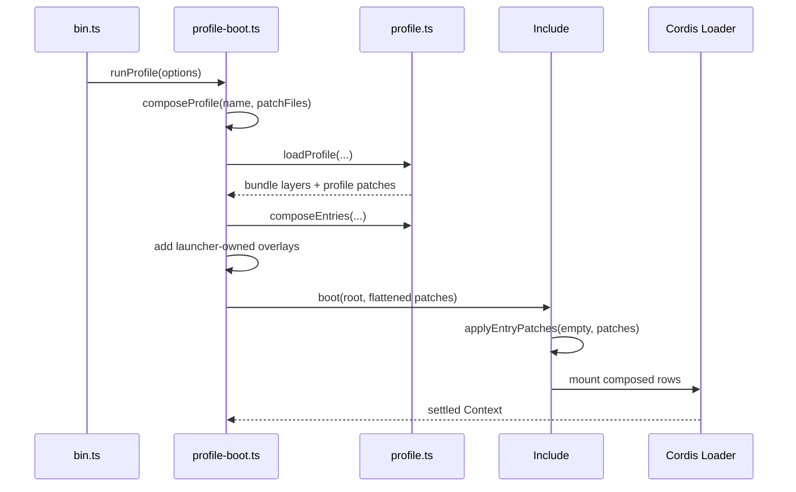

# 02：从 dsh 命令追到插件树

这一章按调用关系阅读源码。主线分成两条：普通启动进入 `runProfile()`，配置查看进入 `runDumpConfig()`；二者共用 profile 解析和 patch 算法，但查看命令不会启动插件。

## 入口只做模式分派

[`apps/cli/src/bin.ts`](../../../apps/cli/src/bin.ts) 先调用 `parseDshArgs()`，再按结果动态导入对应模块：

```text
parseDshArgs(argv)
├── mode: profile      -> runProfile(...)
├── mode: dump-config  -> runDumpConfig(...)
└── mode: plugin       -> runPlugin(...)
```

启动器只解析 `--profile`、`--patch` 与 dump 选项。遇到第一个不属于启动器的参数后，剩余参数原样交给插件树中的应用插件，所以 Web 与 Headless 可以各自定义参数而不修改总入口。

## 普通启动的主线

核心编排在 [`apps/cli/src/profile-boot.ts`](../../../apps/cli/src/profile-boot.ts)：



`prepareProfile()` 先维护 profile 的模块解析后备目录，再调用 `loadProfile()`，最后把 profile 根 `cordis.yml` 写回空数组。`composeProfile()` 随后读取 profile 层、home 层和每个 `--patch` 文件，并通过 `composeEntries()` 建立 id 到最终行的索引，供启动器自己的调整使用。

`runProfile()` 把全部 patch 展平成一个数组传给 `boot()`。`boot()` 创建根 `Context`、安装 Loader、注册内建的 `cordis:include` 与 `cordis:group`，然后让 Include 读取空根并应用 patch。树结算后，启动器还会检查每个启用行是否真正加载并激活；模块解析失败、插件初始化失败和缺少注入服务都会变成明确的启动错误。

## loadProfile 做了什么

[`loadProfile()`](../../../packages/boot/app-boot/src/profile.ts) 的工作可以拆成五步：

1. 用 `resolveProfileDir()` 把 profile 名限制在 `$DSH_HOME/profiles` 的单层子目录，拒绝空名、路径分隔符、`.`、`..` 和保留的 `node_modules`。
2. 如果 `web` 或 `headless` 尚不存在，用 `initProfile()` 写入模板 manifest、空用户 patch 和 pnpm workspace 配置。
3. 读取 `package.json` 中的 `dsh.profile.bundles`；缺省时把它当成空列表。
4. 对每个包调用 `resolveBundleDir()`，读取其 `package.json` 中的 `dsh.bundle.patch`，再用 `loadOverlayPatches()` 解析对应 YAML。
5. 如果调用方需要用户层且 `cordis.patch.yml` 存在，解析它并与 bundle 层一起返回。

一个列入 `bundles` 的包如果没有 `dsh.bundle` 声明会立即报错。显式列出一个包就是声明“它必须提供组合层”，因此静默忽略会掩盖错误配置。

## 为什么是双锚点解析

`resolveBundleDir()` 按固定顺序搜索：先从正在运行的 dsh 安装目录解析，再从 profile 目录解析。

第一锚点保证 `@deepseek-ai/dsh-base` 等内置组合包与启动器来自同一次安装，profile 里的同名包不能遮蔽它。第二锚点让用户通过 `dsh plugin --profile <name> add <package>` 安装的树外组合包可被找到。

插件行本身还需要解析它们的 `name`。`healProfilesModuleFallback()` 会遍历 dsh 应用依赖及其依赖闭包，在 `$DSH_HOME/profiles/node_modules` 下维护扁平符号链接；Node 从 profile 自己的 `node_modules` 向父目录查找时，既能找到树外插件，也能找到安装内置包，并共享同一个 Cordis 实例。

## dump-config 走的是离线路径

[`runDumpConfig()`](../../../apps/cli/src/dump-config.ts) 同样调用 `prepareProfile()`，但它只把每层交给 [`renderConfigDump()`](../../../packages/boot/app-boot/src/index.ts)。该函数使用 Include 导出的同一套 YAML schema 与 `applyEntryPatches()`，因此显式文件层的合成语义与启动一致，同时不会导入或执行任何插件。

输出中的 `# ==` 注释记录一段配置行来自哪一层、后来又被哪些层修改。`!!js` 表达式保持原文，不会在 dump 阶段求值；真正挂载时才会在目标行已经具备注入服务的上下文中计算。

源码阅读时还要注意一个范围差异：`runDumpConfig()` 展示 bundle、profile、home 与命令行 patch 文件；`composeProfile()` 在真实启动中还可能追加启动器拥有的 agent preset root 和遥测硬关闭 patch。因而 dump 是检查文件组合的权威工具，不是运行时对象快照。

## 用户 patch 为什么能热更新

启动完成后，`runProfile()` 为 profile 与 home 两份 `cordis.patch.yml` 注册 `watchUserPatches()`。任一文件变化时，回调都会重新读取两份用户文件，把 bundle 层放在下面、命令行与启动器层放在上面，克隆整份 patch 列表后事务式更新根 Include。

重读全部用户层而不是只替换变化的那一段，可以避免两个文件监听器各自持有过期副本。克隆 patch 则防止 Include 在处理 `insert` 和后续覆盖时修改共享对象，使删除某次覆盖后能够恢复到组合包默认值。

下一章进入 Include 本身，精确解释每一种 patch 如何改变条目。

