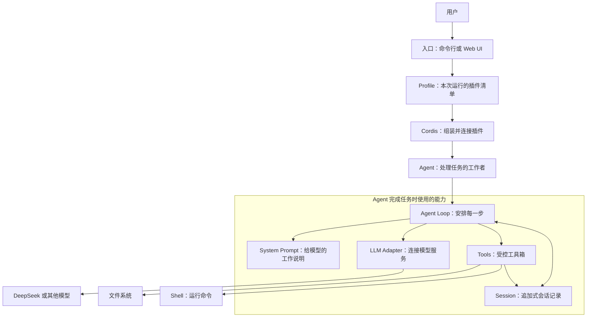
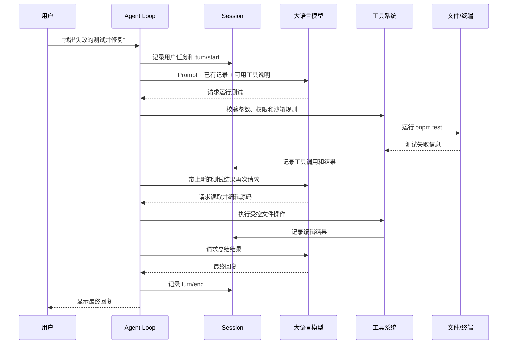
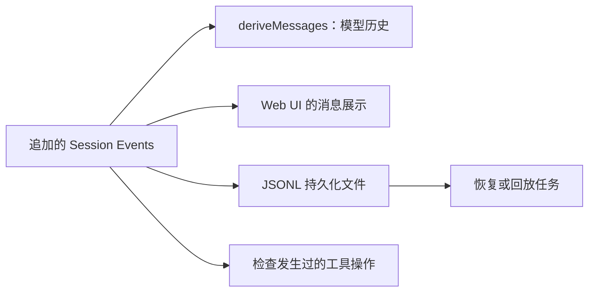
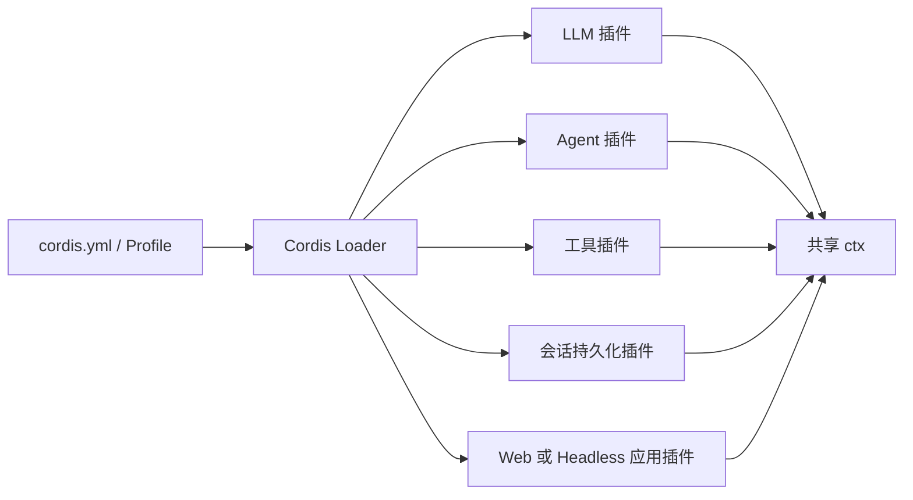

# DeepSeek Harness：零基础架构导读

这是一份给刚开始学习 Agent（智能体）开发的读图说明。目标不是记住所有包名，而是理解一个 Agent 如何接收任务、向大语言模型提问、使用工具、保存过程，并在任务完成时回复用户。

## 先建立全局印象

DeepSeek Harness（简称 dsh）是一个可组装的 Agent 框架。它把模型、文件读写、终端命令、会话记录和 Web 界面做成可以替换的插件。你可以把它想成搭积木：不同插件各做一件事，配置文件决定本次运行装上哪些积木。

图中最重要的关系是：模型负责判断和生成内容；工具负责读取、修改或执行外部操作；Agent Loop 负责把两者串起来；Session 负责留下可恢复的记录。

## 先认识几个名词

| 名词 | 简单解释 | 在本项目中的作用 |
|---|---|---|
| Agent（智能体） | 能根据目标连续采取行动的程序，不只是一次问答。 | 接收任务，调用模型和工具，直到没有后续工作。 |
| LLM（大语言模型） | 能理解和生成文字的模型，例如 DeepSeek。 | 提供“下一步该做什么”的判断和最终文字回答。 |
| Prompt（提示词） | 与用户消息一起交给模型的说明文字。 | 告诉模型身份、规则、当前上下文和可用工具。 |
| Tool（工具） | 模型可请求、程序实际执行的受控操作。 | 例如读文件、搜索文件、编辑文件和运行测试。 |
| Session（会话） | 一次任务产生的完整记录。 | 保存用户消息、模型输出、工具调用和工具结果。 |
| Event（事件） | 已经发生的一条不可变事实。 | 例如“用户发了一条消息”或“工具返回了结果”。 |
| Plugin（插件） | 向运行中的程序提供一种能力的小模块。 | 可替换模型提供方、文件系统、持久化方式或 UI。 |
| Profile（配置档） | 一组插件和配置的组合。 | `web` 启动网页界面，`headless` 运行一次命令行任务。 |
| Sandbox（沙箱） | 对命令和文件操作施加范围限制的安全机制。 | 防止 Agent 随意访问或修改不该碰的内容。 |

## 一次任务怎样完成

假设用户说：“找出失败的测试并修复它。”这不是模型一次回答就能保证完成的任务，所以 Agent 会循环工作。

### 1. 用户任务进入 Inbox

Inbox（收件箱）是 Agent 的待办队列。用户消息、后续补充、子 Agent 的回信和系统加入的上下文都可以进入这个队列。统一排队使 Agent 不必为每一种消息单独设计处理逻辑。

### 2. Agent Loop 领取工作并创建一个 turn

Agent Loop 是任务处理的调度器。turn（轮次）表示一次连续的工作周期；一个 turn 可以包含多个 step（步骤）。每个步骤通常是“一次模型请求，以及模型要求的若干工具调用”。

### 3. 系统准备模型请求

发送请求前，系统会合并三类内容：系统提示词、从会话记录还原的历史消息、当前可用工具的参数说明。模型因此既能理解任务，也知道哪些操作可以请求。

### 4. 模型流式返回内容

流式响应表示模型生成的内容会逐段到达，而不是等待整段回答全部完成。每段内容都会记录到 Session；完整输出可能是普通文字，也可能含有工具调用请求。

### 5. 工具系统执行外部操作

模型只能“请求”工具，不能自己直接运行命令或改文件。工具系统会先检查工具名、参数、权限和沙箱策略，再调用真正的文件系统或终端程序。结果会回到模型可见的会话记录中。

### 6. Agent 决定继续还是结束

如果模型没有再请求工具，本步骤完成；如果还有新的输入或工具结果需要处理，Agent Loop 会开启下一步。直到没有待办工作，系统写入 `turn/end` 并把模型的最终回复交给用户。

## 为什么要保存 Session

Session 不是普通的聊天记录。它是一条只追加的事件日志：每个关键事实按发生顺序写入，例如用户消息、模型文本片段、工具调用和工具结果。系统通过这些事件重新生成下一次模型需要看到的历史。

这种设计带来四个直接好处：模型上下文不会依赖一份随意修改的内存对象；界面可以重放过程；进程中断后可以恢复；开发者能检查 Agent 为什么做出某个操作。

## 插件怎样组成一个产品

本项目不把所有功能写进一个“大 Agent 类”。每个插件向共享上下文 `ctx` 注册服务、事件监听器或工具；配置文件决定哪些插件加载。Cordis 负责加载这些插件，并在插件停止时撤销它们登记的内容。

例如，`dsh-llm-deepseek` 提供 DeepSeek 模型连接；把它替换为另一个符合相同接口的模型插件后，Agent Loop 不必改动。类似地，本地文件系统可以替换为远程沙箱实现，面向模型的文件工具仍使用同一个 `ctx.fs` 服务。

## 从哪里开始读源码

按下列顺序阅读，每读完一个部分，都回到上面的“任务怎样完成”流程确认它解决了哪一步。

1. [架构总览](../../docs/architecture.zh.md)：先理解 Cordis、插件、事件、turn 与会话日志。
2. [Headless 示例配置](../../examples/headless-agent/cordis.yml)：看一个完整 Agent 由哪些插件组成。
3. [CLI 入口](../../apps/cli/src/bin.ts)：看 `dsh` 如何选择并启动 profile。
4. [Agent Loop](../../packages/core/agent-loop/src/agent.ts)：重点读 `ReactLoopAgent.step()`；它发出模型请求、记录输出并处理工具调用。
5. [Session](../../packages/core/session/src/index.ts) 和 [消息投影](../../packages/core/session/src/surface.ts)：理解 `deriveMessages()` 如何从事件还原模型历史。
6. [系统提示词](../../packages/core/system-prompt/src/index.ts) 与 [工具运行时](../../packages/core/tools/src/index.ts)：理解模型如何看到工具定义，以及工具如何被受控执行。
7. [LLM 通用接口](../../packages/llm/llm/src/index.ts) 与 [DeepSeek 适配器](../../packages/llm/llm-deepseek/src/adapter.ts)：理解不同模型服务如何使用统一方式接入。
8. [JSONL 持久化](../../packages/session/session-persistence-jsonl/src/index.ts)、[沙箱](../../docs/subsystems/sandbox.zh.md) 和 [审批](../../docs/subsystems/approval.zh.md)：理解恢复和安全约束。

## 推荐的第一个练习

先不要改 Agent Loop。选择一个小而独立的能力，例如制作只读的 `git_status` 工具：定义它接收什么参数、返回什么结果、如何在沙箱内运行，再把它注册到工具系统中。这样会自然经过“工具 schema → Prompt → 模型请求 → 受控执行 → Session 记录”这条完整链路。

添加工具的具体步骤见[添加工具指南](../../docs/cookbook/adding-a-tool.zh.md)。当你能解释一次工具调用为什么会出现在模型上下文、日志和 UI 中时，就已经掌握了这个项目最核心的 Agent 开发思路。
